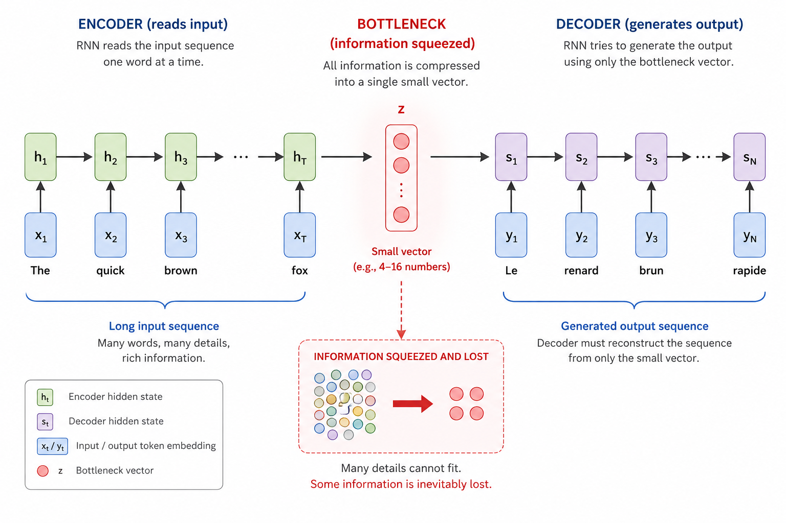
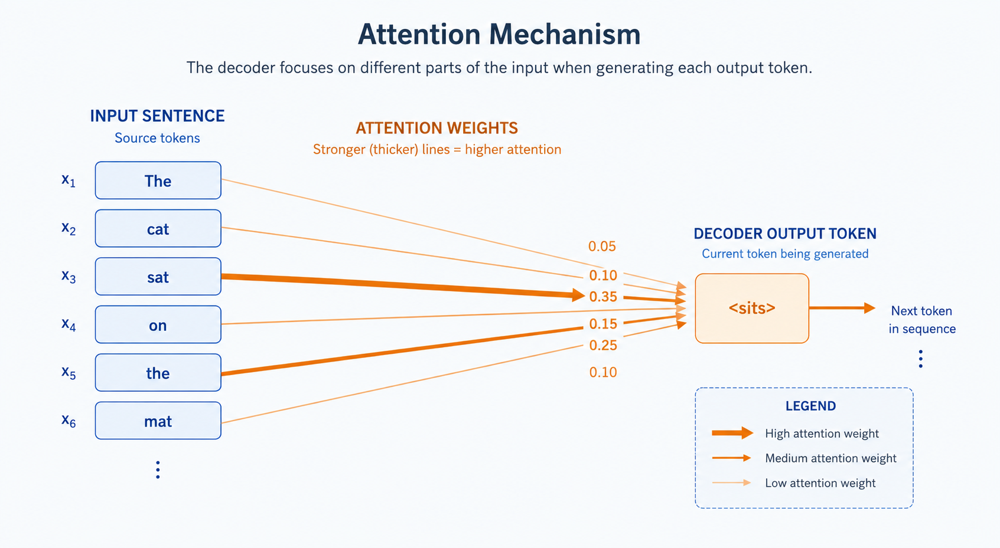
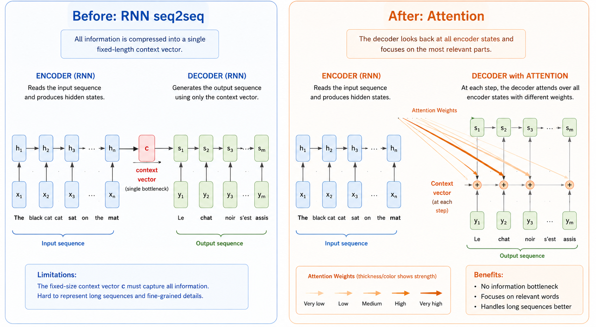

# Why Attention Matters
> The idea that taught machines to focus — and changed AI forever

**What you will learn:** Why RNNs fail on long sequences, what the bottleneck problem is, how attention solves it with a simple but powerful idea, and why this single concept is the foundation of GPT, BERT, and every modern language model including ChatGPT.

---

## 🌟 The Story That Started It All

It is 2014. Google Translate exists, but it is embarrassingly bad at long sentences. The longer the sentence, the worse the translation gets. A PhD student named Dzmitri Bahdanau is frustrated. He is working on a neural machine translation system that compresses an entire input sentence into a single fixed-size vector — and then tries to generate the translation from that one vector alone.

He asks a simple question: *"What if instead of compressing everything into one vector, the model could look back at the input and focus on the relevant words at each step of decoding?"*

In 2015, he and his co-authors published "Neural Machine Translation by Jointly Learning to Align and Translate." It introduced **attention**. Within three years, the transformer architecture — built entirely on attention — replaced RNNs across every NLP task. Today, GPT-4, Gemini, and Claude all run on this idea.

---

## 1. What is the Problem Attention Solves?

Before attention, the dominant approach for sequence tasks (translation, summarization, question answering) was the **sequence-to-sequence (seq2seq) model with RNNs**.

Here is how it worked: An encoder RNN reads the input sentence word by word, updating a hidden state at each step. After reading the entire sentence, it compresses everything into one final hidden state vector — called the **context vector**. The decoder RNN then uses only this one vector to generate the output translation, word by word.

The analogy: imagine reading a 500-word paragraph, then closing the book, and trying to answer detailed questions about it from memory alone — with no ability to glance back. That is exactly what the decoder was forced to do.

This is called the **bottleneck problem**: one fixed-size vector cannot possibly carry all the information from a long input sequence. The longer the sentence, the more information is lost, and the worse the output becomes.

> 🖼️ 
*Source: [Generated using ChatGPT (OpenAI)]*

---

## 2. What is Attention — In Plain Language?

Attention gives the decoder a way to **look back at all encoder hidden states** — not just the last one — and decide which input words to focus on at each decoding step.

Think of it like a human translator working with a document. You do not read the full document once, memorize it, close it, and then translate from memory. Instead, you keep glancing back at the original text — focusing on different parts as you write each sentence of the translation.

**The "Aha!" Moment:**

When generating the output token "sits", the decoder assigns the highest attention weight to the input word "sat" and lower weights to words such as "the", "cat", "on", and "mat". The decoder then forms a weighted combination of all encoder representations, dominated by the representation of the most relevant source word. This allows the model to focus on the parts of the input that are most useful for producing the current output token.

This is attention: **a learned, dynamic, weighted average of all input positions.**

> 🖼️ 
*Source: [Generated using ChatGPT (OpenAI)]*

---

## 3. Mathematical Formulation

Attention computes a weighted sum of **values (V)** where the weights come from comparing a **query (Q)** against a set of **keys (K)**.

At each decoding step t, the attention score between decoder state sₜ and encoder hidden state hᵢ is:

```
score(sₜ, hᵢ) = sₜᵀ · hᵢ         (dot-product attention)
```

The scores are normalized into weights using softmax:

```
αₜᵢ = softmax(score(sₜ, hᵢ))  =  exp(score(sₜ, hᵢ)) / Σⱼ exp(score(sₜ, hⱼ))
```

The context vector for decoding step t is:

```
cₜ = Σᵢ αₜᵢ · hᵢ
```

| Symbol | Meaning |
|--------|---------|
| **sₜ** | Decoder hidden state at time step t |
| **hᵢ** | Encoder hidden state for input position i |
| **score(sₜ, hᵢ)** | Relevance of input position i when generating output t |
| **αₜᵢ** | Attention weight — how much to focus on input position i at step t |
| **cₜ** | Context vector — weighted sum of encoder states for step t |

**What this tells us:** αₜᵢ is a number between 0 and 1. All αₜᵢ sum to 1 (softmax ensures this). A high αₜᵢ means "when generating output word t, pay a lot of attention to input word i." The context vector cₜ is the model's focused summary of the input, tailored to what it needs to generate next.

---

## 4. How It Works — Step by Step

**Example:** Translating "The cat sat" → "Le chat s'est assis"

**Step 1:** Encoder reads ["The", "cat", "sat"] and produces hidden states [h₁, h₂, h₃]

**Step 2:** Decoder starts generating. At step t=1 (generating "Le"):
- Compute scores: score(s₁, h₁), score(s₁, h₂), score(s₁, h₃)
- Example scores: [2.1, 0.3, 0.1]

**Step 3:** Apply softmax to get attention weights:
- α = softmax([2.1, 0.3, 0.1]) ≈ [0.79, 0.13, 0.08]
- This means: 79% focus on "The", 13% on "cat", 8% on "sat"

**Step 4:** Compute context vector:
- c₁ = 0.79 × h₁ + 0.13 × h₂ + 0.08 × h₃

**Step 5:** Decoder uses c₁ + s₁ to generate "Le"

**Step 6:** Repeat for next output word — different attention weights each time

> 🔍 *Real-world connection: This is exactly what happens in Google Translate today. When translating a long legal document, the model attends to different clauses as it generates each translated sentence.*

---

## 5. RNN vs Attention — Before and After

| Aspect | RNN seq2seq (Before) | Attention (After) |
|--------|---------------------|-------------------|
| **Information storage** | Single fixed context vector | All encoder hidden states available |
| **Long sequence handling** | Degrades significantly | Handles long sequences well |
| **Parallelization** | Sequential — cannot parallelize | Attention scores computable in parallel |
| **Interpretability** | Black box | Attention weights show what model focuses on |
| **Memory of early tokens** | Fades over long sequences | Direct access to any position |
| **Training speed** | Slow — sequential backprop | Much faster with parallelism |

> 🖼️
*Source: [Generated using ChatGPT (OpenAI)]*

---

## 6. Real World Applications

**1. Google Translate (Google, 2016)**
Google completely rebuilt its translation system using attention-based neural networks in 2016, calling it Google Neural Machine Translation (GNMT). The improvement in translation quality was equivalent to decades of previous progress. Long sentences — which previously degraded badly — became dramatically better.

**2. Speech Recognition (Baidu, Amazon Alexa)**
Attention mechanisms are used in speech-to-text systems to align audio frames with output characters. When generating the word "hello", the model attends to the specific milliseconds of audio where "hello" was spoken — ignoring irrelevant background sounds.

**3. Medical Image Analysis (Healthcare)**
Attention is used in radiology AI to highlight which regions of an X-ray or MRI scan the model focused on when making a diagnosis. This makes the model interpretable — doctors can see what the AI "looked at", building trust in clinical settings.

> 🖼️
*Source: [Source from internet]*

---

## 7. Key Limitations of Basic Attention

| Limitation | Description |
|------------|-------------|
| **Still uses RNN encoder** | Original Bahdanau attention still relies on sequential RNN — not fully parallelizable |
| **O(n²) complexity** | Computing attention between all pairs of positions is expensive for very long sequences |
| **No positional awareness** | Attention alone does not know the order of tokens — needs positional encoding |
| **Single perspective** | Basic attention uses one set of weights — multi-head attention (next topic) fixes this |

---

## 8. When to Use / When Not to Use

| ✅ Attention is the right choice when | ❌ Consider alternatives when |
|--------------------------------------|------------------------------|
| Input sequences are long (> 20 tokens) | Sequences are very short and simple |
| You need interpretability (which input matters) | Computational resources are severely limited |
| Task requires aligning input and output positions | Real-time edge deployment with tiny models |
| You are building on top of a transformer | Simple pattern matching — regex or lookup suffices |

---

## 9. Implementation Overview

| Approach | Tool | What It Builds |
|----------|------|---------------|
| **From Scratch** | NumPy | Dot-product attention scores, softmax weights, context vector |
| **Library** | PyTorch | `torch.nn.MultiheadAttention` — production-ready implementation |

```python
import torch
import torch.nn as nn

# PyTorch built-in attention
attention = nn.MultiheadAttention(embed_dim=64, num_heads=1, batch_first=True)
output, weights = attention(query, key, value)
```

---

## 10. Top 5 Interview Questions

1. **What problem does attention solve that RNNs cannot handle well?**
   - RNNs compress entire input into one fixed vector — information bottleneck
   - Long sequences lose early context — attention gives direct access to all positions
   - Attention allows decoder to focus on relevant input parts at each output step

2. **What is the bottleneck problem in seq2seq models?**
   - Encoder final hidden state must carry ALL information from the input
   - Fixed size vector — cannot scale with sequence length
   - Attention replaces this with a dynamic, weighted summary computed fresh at each step

3. **What do attention weights αₜᵢ represent?**
   - Probability distribution over input positions (sum to 1 via softmax)
   - How much the decoder should focus on each input position when generating output t
   - Interpretable — can be visualized as a heatmap

4. **What is the difference between hard and soft attention?**
   - Soft attention (Bahdanau): weighted average of ALL positions — differentiable, trainable with backprop
   - Hard attention: select ONE position with highest weight — non-differentiable, needs reinforcement learning
   - Transformers use soft attention

5. **Why can transformers parallelize but RNNs cannot?**
   - RNN: hidden state at step t depends on step t-1 — strictly sequential
   - Attention: all attention scores computable simultaneously — no sequential dependency
   - This parallelism makes transformer training dramatically faster on GPUs

---

## 11. Quick Reference Table

| Item | Detail |
|------|--------|
| **Proposed by** | Bahdanau et al., 2015 |
| **Problem solved** | Information bottleneck in RNN seq2seq models |
| **Core operation** | Weighted sum: cₜ = Σᵢ αₜᵢ · hᵢ |
| **Weight computation** | softmax(score(sₜ, hᵢ)) |
| **Score function** | Dot product, additive (Bahdanau), or scaled dot product |
| **Complexity** | O(n²) in sequence length |
| **Key benefit** | Direct access to all input positions; interpretable weights |
| **Leads to** | Self-attention → Multi-head attention → Transformer |

---

## 12. References & Further Reading

1. [Bahdanau et al. 2015 — Original Attention Paper](https://arxiv.org/abs/1409.0473)
2. [Illustrated Attention — Jay Alammar's Blog](https://jalammar.github.io/visualizing-neural-machine-translation-mechanics-of-seq2seq-models-with-attention/)
3. [Stanford CS224N: Attention Lecture Notes](https://web.stanford.edu/class/cs224n/)
4. [Distill.pub: Attention and Augmented RNNs](https://distill.pub/2016/augmented-rnns/)
5. [The Annotated Transformer — Harvard NLP](https://nlp.seas.harvard.edu/2018/04/03/attention.html)
