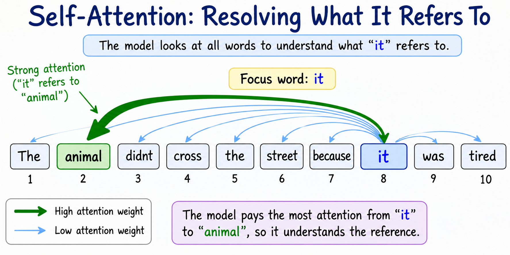
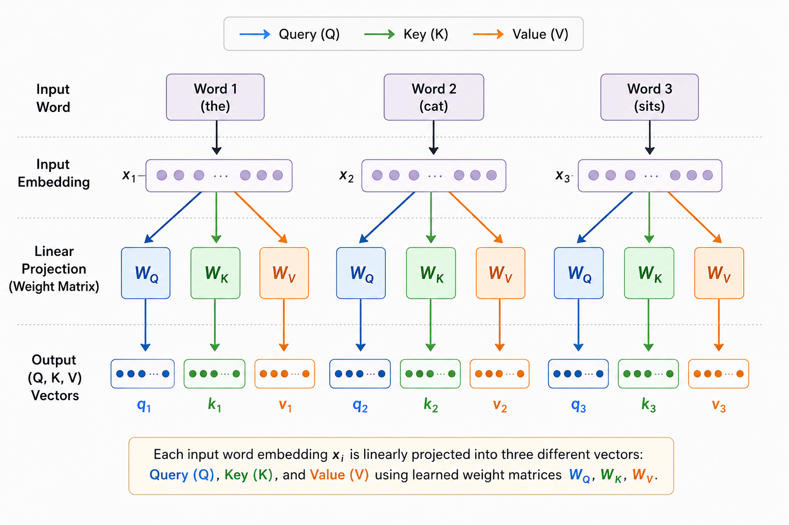
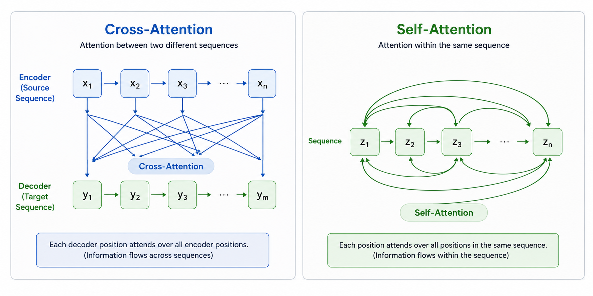
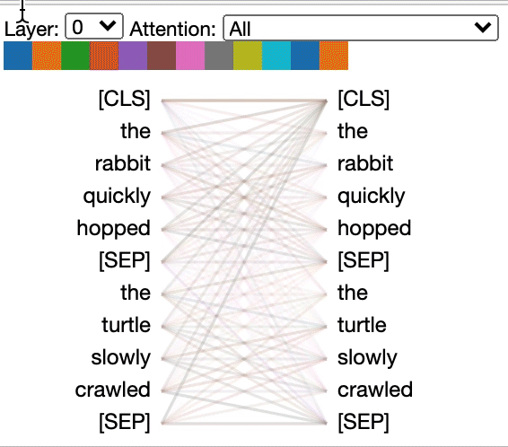

# Self-Attention
> When every word gets to look at every other word — including itself

**What you will learn:** What self-attention is and how it differs from the cross-attention you saw in Topic 1, what Query, Key, and Value vectors actually represent, why the dot product is scaled by √dₖ, and how this single mechanism lets every token in a sentence directly interact with every other token.

---

## 🌟 The Story That Started It All

It is 2017. A team at Google Brain is staring at a problem. Attention (from Topic 1) made translation much better — but it was still bolted onto an RNN. The RNN was still slow, still sequential, still struggling with very long documents.

Ashish Vaswani and his co-authors ask a radical question: *"What if we removed the RNN entirely? What if attention wasn't just a helper mechanism for the decoder — what if it WAS the entire model?"*

To make this work, they needed every word in a sentence to be able to look at every other word in that same sentence — not just the decoder looking at the encoder, but words looking at each other within one sequence. They called this **self-attention**, and it became the single most important building block of the paper titled "Attention Is All You Need." That paper created the Transformer — and the Transformer created GPT, BERT, and everything that followed.

---

## 1. What is Self-Attention?

In Topic 1, attention connected two different sequences: the decoder looked at the encoder. This is called **cross-attention**.

**Self-attention is different: a sequence looks at itself.** Every word in a sentence computes attention scores against every other word in that SAME sentence — including itself.

Think of it like a group discussion where everyone listens to everyone else before forming their final opinion. When the word "it" appears in a sentence, self-attention lets "it" look at every other word in the sentence and figure out which word "it" actually refers to. If the sentence is "The animal didn't cross the street because it was tired," self-attention allows "it" to attend strongly to "animal" — resolving the ambiguity.

This is exactly what the learning outcome means by **"understanding token interactions through attention"** — self-attention is the mechanism by which tokens interact with and inform each other.

>
*Source: [Generated using ChatGPT (OpenAI)]*

---

## 2. Query, Key, Value — The Three Roles

Self-attention introduces three learned projections of the same input embedding: **Query (Q)**, **Key (K)**, and **Value (V)**.

Think of it like a library search system:
- **Query** = what you are searching for ("books about space travel")
- **Key** = the index tag on each book ("astronomy", "cooking", "fiction")
- **Value** = the actual content of the book you receive once there's a match

Every word produces all three: its own Query (what is it looking for), its own Key (what does it offer to others), and its own Value (what information does it contain). The word compares its Query against every other word's Key to decide how much attention to pay, then retrieves a weighted combination of everyone's Values.

**The "Aha!" Moment:**

For the sentence "The cat sat", the word "sat" generates a Query asking "who is doing this action?" It compares this Query against the Keys of "The" and "cat". Because "cat" is a noun and likely subject, its Key matches well with this kind of Query — "sat" ends up attending strongly to "cat", learning that cat is the one sitting.

> 🖼️ 
*Source: [Generated using ChatGPT (OpenAI)]*

---

## 3. Mathematical Formulation

Given an input matrix X of token embeddings, we compute Q, K, V via learned weight matrices:

```
Q = XWQ      K = XWK      V = XWV
```

The full **Scaled Dot-Product Attention** formula:

```
Attention(Q, K, V) = softmax(QKᵀ / √dₖ) V
```

| Symbol | Meaning |
|--------|---------|
| **X** | Input embedding matrix — shape (seq_len, d_model) |
| **WQ, WK, WV** | Learned weight matrices that project X into Q, K, V |
| **Q** | Query matrix — shape (seq_len, dₖ) |
| **K** | Key matrix — shape (seq_len, dₖ) |
| **V** | Value matrix — shape (seq_len, dᵥ) |
| **QKᵀ** | Raw similarity scores between every pair of tokens — shape (seq_len, seq_len) |
| **dₖ** | Dimension of the Key/Query vectors |
| **√dₖ** | Scaling factor — prevents scores from becoming too large |

**What this tells us:** QKᵀ produces a full matrix where entry (i,j) is how much token i's query matches token j's key. We divide by √dₖ to keep these values in a reasonable range, apply softmax row-wise to get probability weights, then multiply by V to get a new representation for every token — each one now informed by every other token.

**Why scale by √dₖ specifically?** When dₖ is large, the dot product QKᵀ has values with larger variance (since it sums dₖ terms). Large values pushed through softmax create extremely peaked distributions — gradients vanish, and only one token gets any attention. Dividing by √dₖ keeps the variance approximately constant regardless of dimension, keeping softmax in a well-behaved range.

---

## 4. How It Works — Step by Step

**Example:** Self-attention for the sentence "The cat sat" (3 tokens)

**Step 1:** Each word's embedding is projected into Query, Key, Value vectors using learned matrices WQ, WK, WV

**Step 2:** Compute QKᵀ — a 3×3 matrix of raw scores. Entry (i,j) = how much token i attends to token j
```
scores = [[s_The,The, s_The,cat, s_The,sat],
          [s_cat,The, s_cat,cat, s_cat,sat],
          [s_sat,The, s_sat,cat, s_sat,sat]]
```

**Step 3:** Scale every entry by dividing by √dₖ

**Step 4:** Apply softmax to each ROW — each row now sums to 1, representing how much that token attends to every token (including itself)

**Step 5:** Multiply the resulting weight matrix by V — each token gets a new representation that blends information from all tokens, weighted by relevance

**Step 6:** The output is the same shape as the input — but now every token's representation has absorbed context from every other token

> 🔍 *Real-world connection: This is exactly what happens inside every layer of BERT and GPT. Every single token representation is constantly being updated by looking at every other token in the sequence, layer after layer.*

---

## 5. Cross-Attention (Topic 1) vs Self-Attention — Before and After

| Aspect | Cross-Attention (Topic 1) | Self-Attention (Topic 2) |
|--------|---------------------------|---------------------------|
| **What attends to what** | Decoder attends to Encoder (two different sequences) | Sequence attends to itself (same sequence) |
| **Query source** | Decoder hidden state | Same sequence's own embeddings |
| **Key/Value source** | Encoder hidden states | Same sequence's own embeddings |
| **Used in** | Original Bahdanau attention, encoder-decoder bridge | Transformer encoder, Transformer decoder, BERT, GPT |
| **Purpose** | Align output generation with relevant input parts | Build contextual understanding within one sequence |

> 🖼️ 
*Source: [Generated using ChatGPT (OpenAI)]*


---

## 6. Real World Applications

**1. BERT — Google Search (2019)**
BERT uses self-attention across the entire input sentence in both directions (bidirectional). Google integrated BERT into Search, calling it one of the biggest improvements to Search in the past five years, specifically improving understanding of conversational and complex queries.

**2. GPT and ChatGPT — OpenAI**
Every layer of GPT uses self-attention, but with a causal mask so each token can only attend to previous tokens (not future ones) — this is what allows it to generate text one token at a time while remaining consistent with everything written before.

**3. Protein Structure Prediction — AlphaFold (DeepMind)**
AlphaFold 2 uses self-attention mechanisms (adapted as "Evoformer" blocks) to model interactions between amino acids in a protein sequence — letting distant amino acids that fold close together in 3D space directly inform each other, contributing to a breakthrough in biology.

> 🖼️ 
*Source: [Source from internet]*


---

## 7. Key Assumptions and Limitations

| Assumption / Limitation | Description |
|--------------------------|-------------|
| **No inherent order awareness** | Self-attention treats input as a set — it does not know token order without positional encoding (Topic 4) |
| **O(n²) memory and compute** | Every token attends to every other token — a sequence of length n needs n² attention score computations |
| **Single representation per head** | One Q, K, V projection can only capture one "type" of relationship — Multi-Head Attention (Topic 3) fixes this |
| **No built-in causality** | By default, self-attention lets every token see every other token; causal masking must be added explicitly for autoregressive generation |

---

## 8. When to Use / When Not to Use

| ✅ Self-Attention is ideal when | ❌ Consider alternatives when |
|----------------------------------|-------------------------------|
| You need every token to be aware of full context | Sequences are extremely long (100K+ tokens) — quadratic cost becomes prohibitive |
| Building encoder representations (BERT-style) | Strict real-time, low-latency constraints on tiny devices |
| Building autoregressive generation (GPT-style, with causal mask) | Memory is severely constrained |
| Order doesn't need to be hard-coded (handled separately via positional encoding) | Simple sequential patterns where RNNs/CNNs are sufficient |

---

## 9. Implementation Overview

| Approach | Tool | What It Builds |
|----------|------|----------------|
| **From Scratch** | NumPy | Q, K, V projections, scaled dot-product attention, softmax |
| **Library** | PyTorch | `torch.nn.functional.scaled_dot_product_attention` — the core operation |

```python
import torch.nn.functional as F

# PyTorch's built-in scaled dot-product attention
output = F.scaled_dot_product_attention(query, key, value)
# Internally computes: softmax(QKᵀ / √dₖ) V
```

---

## 10. Top 5 Interview Questions

1. **What is the difference between self-attention and the cross-attention from Topic 1?**
   - Cross-attention: Query comes from one sequence (decoder), Key/Value from another (encoder)
   - Self-attention: Query, Key, AND Value all come from the SAME sequence
   - Self-attention lets a sequence build contextual understanding of itself

2. **Why do we need three separate Q, K, V projections instead of just using the raw embeddings?**
   - Using raw embeddings directly would force the same vector to play three different roles (asking, offering, providing content)
   - Separate learned projections let the model learn distinct, specialized representations for each role
   - This adds flexibility and expressive power that a single shared representation cannot provide

3. **Why is the dot product scaled by √dₖ?**
   - As dₖ grows, dot products QKᵀ have higher variance (sum of more terms)
   - Large values pushed through softmax create extremely peaked distributions — vanishing gradients
   - Dividing by √dₖ keeps the variance roughly constant regardless of dimension, keeping softmax well-behaved

4. **What is the computational complexity of self-attention?**
   - O(n² · d) where n is sequence length and d is embedding dimension
   - The QKᵀ computation alone is O(n²) — this is why very long sequences are expensive
   - This quadratic cost motivated later research into efficient attention variants (sparse attention, linear attention)

5. **What is a causal mask and when do we need it?**
   - A mask that prevents a token from attending to future tokens — sets those positions to -∞ before softmax
   - Needed in decoder self-attention (e.g., GPT) so the model cannot "cheat" by looking ahead during generation
   - Not needed in encoder self-attention (e.g., BERT) where bidirectional context is desired

---

## 11. Quick Reference Table

| Item | Detail |
|------|--------|
| **Introduced in** | Vaswani et al., 2017 — "Attention Is All You Need" |
| **Core formula** | Attention(Q,K,V) = softmax(QKᵀ/√dₖ)V |
| **Inputs** | Q, K, V — all projections of the SAME sequence |
| **Time Complexity** | O(n²·d) |
| **Space Complexity** | O(n²) for the attention score matrix |
| **Key innovation** | Tokens directly interact with all other tokens in one step |
| **Variants** | Bidirectional (BERT-style), Causal/Masked (GPT-style) |
| **Leads to** | Multi-Head Attention, full Transformer architecture |

---

## 12. References & Further Reading

1. [Vaswani et al. 2017 — Attention Is All You Need](https://arxiv.org/abs/1706.03762)
2. [The Illustrated Transformer — Jay Alammar](https://jalammar.github.io/illustrated-transformer/)
3. [The Annotated Transformer — Harvard NLP](https://nlp.seas.harvard.edu/2018/04/03/attention.html)
4. [Stanford CS224N: Self-Attention and Transformers](https://web.stanford.edu/class/cs224n/)
5. [BertViz — Attention Visualization Tool](https://github.com/jessevig/bertviz)
