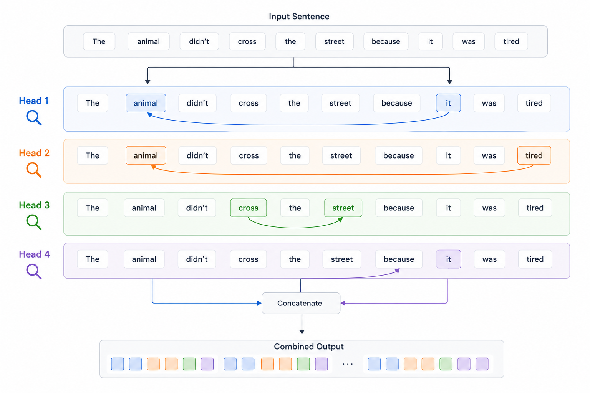
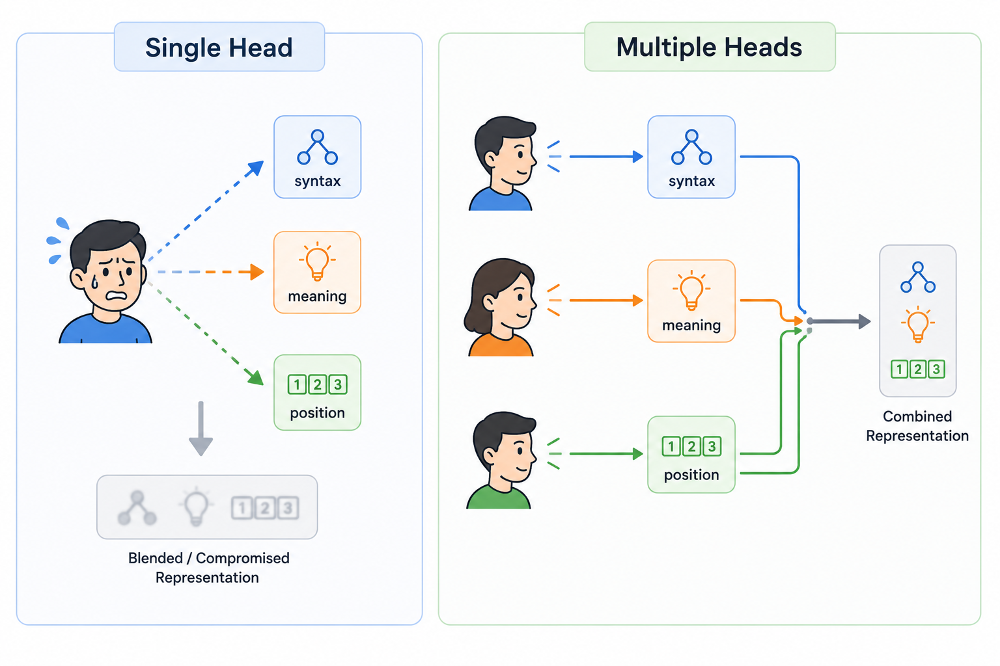
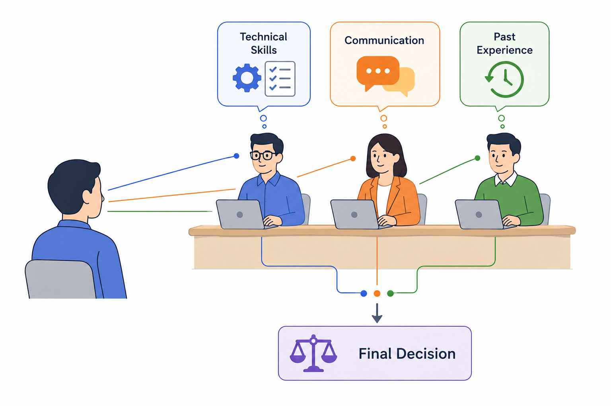
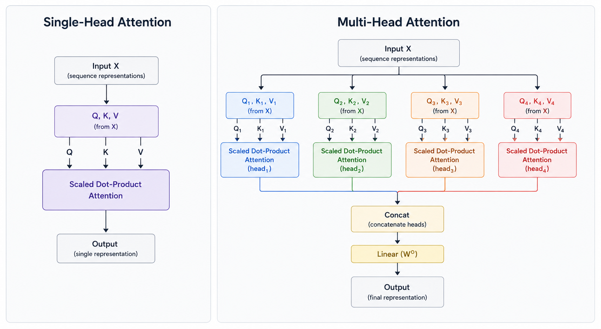

# Multi-Head Attention
> Why settle for one perspective when you can have eight?

**What you will learn:** Why a single attention head is not enough to capture all the relationships inside a sentence, how multi-head attention splits the embedding space and runs several attention operations in parallel, what the output projection matrix Wᴼ actually does, and what different heads tend to learn once trained — syntax, coreference, and position.

---

## 🌟 The Story That Started It All

It is still 2017. The team behind "Attention Is All You Need" has just proven that self-attention (Topic 2) can replace the RNN entirely. But they notice something: a single self-attention operation, no matter how well trained, produces only **one** weighted average per token. One Query, one Key, one Value, one attention distribution.

That is a problem, because language is not one relationship — it is many relationships layered on top of each other, all at once. In the sentence "The animal didn't cross the street because it was tired," resolving what "it" refers to is a *coreference* relationship. Knowing that "cross" is the verb and "animal" is its subject is a *syntactic* relationship. Knowing that "street" and "cross" belong together is a *semantic* relationship. A single attention head has to compress all of these into one set of weights — averaging them together and blurring the distinctions.

So Vaswani and his co-authors ask: *"What if, instead of one attention computation, we ran several smaller ones in parallel — each free to specialize in a different kind of relationship — and then combined their findings?"*

That idea is **multi-head attention**. It does not introduce a new formula — it reuses the exact scaled dot-product attention from Topic 2, just multiple times, side by side, on different slices of the embedding space. This single design choice is one of the main reasons transformers became so much more powerful than anything that came before them.

> 🖼️ 
*Source: [Generated using ChatGPT (OpenAI)]*

---

## 1. What is the Problem Multi-Head Attention Solves?

In Topic 2, self-attention gave every token a context-aware representation by computing **one** Query, **one** Key, and **one** Value per token, then producing **one** attention distribution over the sequence.

The limitation: that one attention distribution must capture every type of relationship the token has with every other token, all blended into a single softmax row. If "sat" needs to attend strongly to "cat" for subject-verb agreement *and* attend strongly to "mat" for the prepositional object, a single head has to split its limited attention budget across both needs — it cannot fully dedicate itself to either.

The analogy: imagine asking one person to simultaneously proofread a document for grammar, fact-check its claims, and judge its emotional tone — all using the same single pass of reading. They could do an average job at all three. Now imagine instead handing the document to three specialists, each reading it once with a different lens, and then combining their notes. That is the difference between single-head and multi-head attention.

This is the **single-perspective problem**: one attention head, no matter how well trained, is forced to learn one averaged notion of "relevance" — multi-head attention lets the model learn several notions of relevance simultaneously.

> 🖼️ 
*Source: [Generated using ChatGPT (OpenAI)]*

---

## 2. What is Multi-Head Attention — In Plain Language?

Multi-head attention does not change the underlying math from Topic 2. It changes **how many times, and on what slice of the data**, that math is applied.

Think of it like a panel of interviewers, each asking the candidate a different category of question — one focused on technical skills, one on communication, one on past experience — and then a hiring manager combining all three assessments into a final decision. Each interviewer is a "head." Each head sees the same candidate (the same input embeddings) but evaluates them from a different angle, because each head gets its own learned Wᴼ, Wᴷ, Wⱽ projections.

**The "Aha!" Moment:**

Take the sentence "The animal didn't cross the street because it was tired." After training, researchers have found that one head in a real transformer will strongly connect "it" to "animal" — solving coreference. A *different* head in the *same layer* will instead connect "tired" to "animal" — capturing which entity the adjective describes. A single head trained alone would have to compromise between these two jobs. Multiple heads let the model assign different jobs to different heads, then combine all of their outputs into one richer representation.

This is multi-head attention: **running several smaller self-attention operations in parallel, each on its own learned subspace, then concatenating and projecting the results back into one combined representation.**

> 🖼️ 
*Source: [Generated using ChatGPT (OpenAI)]*

---

## 3. Mathematical Formulation

Multi-head attention runs `h` parallel attention "heads." Each head gets its own learned projection matrices and operates on a smaller slice of the embedding dimension.

For each head i (where i = 1, ..., h):

```
headᵢ = Attention(QWᵢQ, KWᵢK, VWᵢV) = softmax((QWᵢQ)(KWᵢK)ᵀ / √dₖ) (VWᵢV)
```

The outputs of all heads are concatenated and passed through one final learned projection:

```
MultiHead(Q, K, V) = Concat(head₁, head₂, ..., headₕ) Wᴼ
```

| Symbol | Meaning |
|--------|---------|
| **h** | Number of attention heads |
| **WᵢQ, WᵢK, WᵢV** | Per-head learned projection matrices — each head has its own set |
| **dₖ** | Dimension of Query/Key vectors *per head* — typically d_model / h |
| **headᵢ** | Output of a single attention head — shape (seq_len, dₖ) |
| **Concat(head₁, ..., headₕ)** | All head outputs stacked side by side — shape (seq_len, h·dₖ) = (seq_len, d_model) |
| **Wᴼ** | Final output projection matrix — shape (d_model, d_model) |
| **MultiHead(Q,K,V)** | Final combined output — same shape as a single self-attention output |

**What this tells us:** Each head is a complete, independent scaled dot-product attention operation — identical to Topic 2's formula — but applied to a different learned projection of the input. Crucially, the *total* parameter count and computational cost stays comparable to one large head, because each head operates on a smaller dₖ (commonly d_model / h), not the full d_model. The Concat step stitches the specialized outputs back together, and Wᴼ learns how to best combine the different heads' findings into one unified representation.

---

## 4. How It Works — Step by Step

**Example:** Multi-head self-attention for "The cat sat" with d_model = 8 and h = 2 heads (so each head uses dₖ = 4)

**Step 1:** Start with input embeddings X — shape (3, 8), one 8-dimensional vector per word

**Step 2:** Split into 2 heads. Each head gets its own WᵢQ, WᵢK, WᵢV, projecting the 8-dimensional input down to 4-dimensional Q, K, V for that head:
- Head 1: Q₁, K₁, V₁ — shape (3, 4) each
- Head 2: Q₂, K₂, V₂ — shape (3, 4) each

**Step 3:** Run scaled dot-product attention independently inside each head:
- head₁ = softmax(Q₁K₁ᵀ / √4) V₁ → shape (3, 4)
- head₂ = softmax(Q₂K₂ᵀ / √4) V₂ → shape (3, 4)

**Step 4:** Each head produces its own attention weight matrix — head 1 might learn to focus on subject-verb relationships, head 2 might focus on adjacent-word position patterns. They are trained independently and can specialize differently.

**Step 5:** Concatenate the two head outputs side by side: Concat(head₁, head₂) → shape (3, 8) — back to the original d_model

**Step 6:** Multiply by the final output projection Wᴼ (shape 8×8) to get the final multi-head attention output — shape (3, 8), same shape as the input, but now informed by multiple independent relationship types

> 🔍 *Real-world connection: This is exactly what happens inside every encoder and decoder layer of BERT, GPT, and the original Transformer. GPT-3, for example, uses 96 attention heads per layer — each free to specialize during training.*

---

## 5. Single-Head vs Multi-Head — Before and After

| Aspect | Single-Head Attention (Topic 2) | Multi-Head Attention (This Topic) |
|--------|----------------------------------|--------------------------------------|
| **Number of attention distributions** | One per token | One per token, per head |
| **Representational capacity** | Must average all relationship types into one view | Different heads can specialize in different relationship types |
| **Q, K, V dimension per operation** | Full dₖ = d_model | Reduced dₖ = d_model / h per head |
| **Computational cost** | One attention computation over full dimension | h smaller attention computations — comparable total cost |
| **Interpretability** | One attention heatmap | Multiple heatmaps — can inspect what each head learned |
| **Parameters** | WQ, WK, WV (one set) | WᵢQ, WᵢK, WᵢV per head, plus a shared final Wᴼ |

> 🖼️ 
*Source: [Generated using ChatGPT (OpenAI)]*

---

## 6. Real World Applications

**1. The Original Transformer (Vaswani et al., 2017)**
The base Transformer model used h = 8 heads with d_model = 512, giving each head dₖ = 64. This configuration alone, with no architectural change beyond multi-head attention, outperformed the best RNN-based translation systems of the time while training significantly faster.

**2. BERT — Google Search**
BERT-base uses 12 layers with 12 attention heads each (144 heads total). Researchers studying BERT's heads have found some specialize in tracking direct objects of verbs, others in detecting coreference, and others in attending to the next or previous token — distinct, interpretable behaviors emerging purely from training.

**3. GPT-3 and Modern LLMs (OpenAI, and successors)**
GPT-3's largest configuration uses 96 attention heads per layer across 96 layers. The sheer number of heads available at every layer is part of what allows large language models to simultaneously track grammar, long-range topic coherence, factual associations, and stylistic tone — all within the same forward pass.

> 🖼️ 
*Source: [Source from internet]*

---

## 7. Key Assumptions and Limitations

| Assumption / Limitation | Description |
|--------------------------|--------------|
| **More heads is not always better** | Past a certain point, additional heads yield diminishing returns and some heads become redundant or prunable without hurting performance |
| **Heads are not explicitly told what to specialize in** | Specialization (syntax, coreference, position) emerges naturally from training — it is never hand-assigned, and is not guaranteed to happen cleanly |
| **Still O(n²) per head** | Splitting into multiple heads does not remove the quadratic cost of attention — each head still computes a full seq_len × seq_len score matrix |
| **dₖ per head shrinks as heads increase** | If d_model is fixed, adding more heads means each head works with a smaller dₖ, which can limit how expressive any single head can be |

---

## 8. When to Use / When Not to Use

| ✅ Multi-head attention is the right choice when | ❌ Consider alternatives when |
|----------------------------------------------------|-------------------------------|
| The task involves multiple types of relationships (syntax, semantics, position) | The task is extremely simple and one relationship type dominates |
| You are building any standard Transformer encoder or decoder | Compute or memory budget cannot support h parallel attention operations |
| You want some interpretability into what the model is tracking | You need a single, easily visualized attention map rather than several |
| You are scaling up a model and want more representational capacity without increasing d_model | The sequence is so long that even one head's O(n²) cost is already prohibitive |

---

## 9. Implementation Overview

| Approach | Tool | What It Builds |
|----------|------|---------------|
| **From Scratch** | NumPy | Splitting Q, K, V into heads, per-head scaled dot-product attention, concatenation, output projection |
| **Library** | PyTorch | `torch.nn.MultiheadAttention` — production-ready, fully batched implementation |

```python
import torch
import torch.nn as nn

# PyTorch built-in multi-head attention
multihead_attn = nn.MultiheadAttention(embed_dim=64, num_heads=8, batch_first=True)
output, attn_weights = multihead_attn(query, key, value)
```

---

## 10. Top 5 Interview Questions

1. **Why use multiple attention heads instead of one larger head?**
   - One head must average every type of token relationship into a single attention distribution
   - Multiple heads can specialize — one for syntax, one for coreference, one for position — without competing for the same weights
   - Empirically, multi-head configurations outperform single large-head configurations at the same total parameter budget

2. **How is the embedding dimension split across heads?**
   - d_model is divided by the number of heads h to get the per-head dimension dₖ = d_model / h
   - Each head learns its own WᵢQ, WᵢK, WᵢV that project the full d_model input down to that smaller dₖ
   - This keeps total computation comparable to one full-size head, just distributed across h smaller ones

3. **What is the role of the output projection matrix Wᴼ?**
   - After concatenating all head outputs back into a (seq_len, d_model) matrix, Wᴼ is a learned linear layer applied on top
   - It allows the model to learn how to best mix and weight the different heads' specialized outputs into one unified representation
   - Without Wᴼ, the heads' outputs would just be stacked side by side with no way to blend information across heads

4. **Does multi-head attention increase computational complexity significantly?**
   - Total FLOPs stay roughly the same as one full-dimension head, because each head operates on a proportionally smaller dₖ
   - The complexity remains O(n²·d_model) overall — splitting into heads does not add an extra order of complexity
   - The main added cost is the reshaping/concatenation overhead and the final Wᴼ projection, both of which are minor compared to the attention computation itself

5. **What kinds of patterns do different heads typically learn?**
   - Some heads attend to immediately adjacent tokens — learning local positional patterns
   - Some heads specialize in syntactic relationships — connecting subjects to verbs, or nouns to their modifiers
   - Some heads track coreference — connecting pronouns like "it" back to the noun they refer to, as seen in BERT analysis papers

---

## 11. Quick Reference Table

| Item | Detail |
|------|--------|
| **Introduced in** | Vaswani et al., 2017 — "Attention Is All You Need" |
| **Core formula** | MultiHead(Q,K,V) = Concat(head₁,...,headₕ) Wᴼ |
| **Per-head formula** | headᵢ = softmax((QWᵢQ)(KWᵢK)ᵀ/√dₖ)(VWᵢV) |
| **Typical head count** | 8 (base Transformer), 12 (BERT-base), 96 (GPT-3 large) |
| **Per-head dimension** | dₖ = d_model / h |
| **Time Complexity** | O(n²·d_model) — same order as single-head attention |
| **Key innovation** | Parallel specialized attention subspaces, recombined via Wᴼ |
| **Leads to** | Positional Encoding, full Transformer encoder/decoder blocks |

---

## 12. References & Further Reading

1. [Vaswani et al. 2017 — Attention Is All You Need](https://arxiv.org/abs/1706.03762)
2. [The Illustrated Transformer — Jay Alammar](https://jalammar.github.io/illustrated-transformer/)
3. [The Annotated Transformer — Harvard NLP](https://nlp.seas.harvard.edu/2018/04/03/attention.html)
4. [What Does BERT Look At? An Analysis of BERT's Attention](https://arxiv.org/abs/1906.04341)
5. [BertViz — Attention Visualization Tool](https://github.com/jessevig/bertviz)
