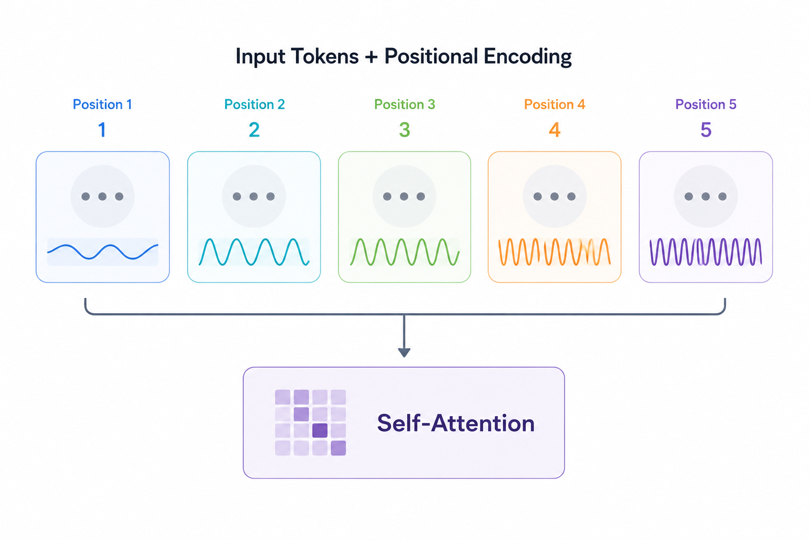
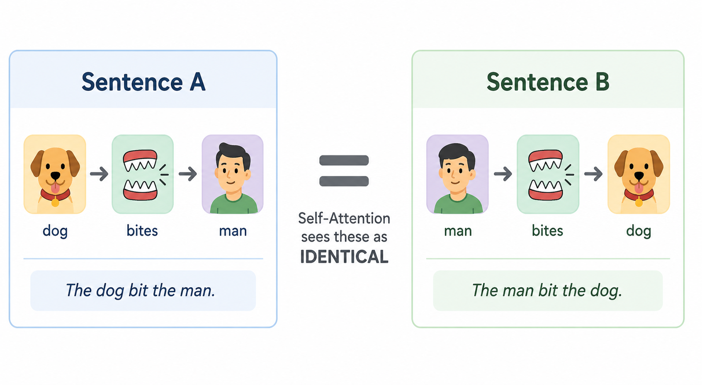
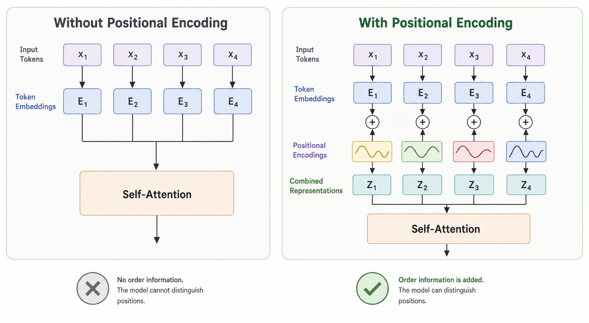
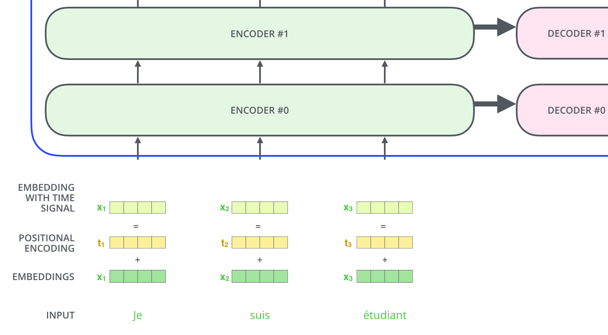

# Positional Encoding
> Teaching a model that "knows everything at once" to understand "before" and "after"

**What you will learn:** Why self-attention and multi-head attention are permutation invariant and cannot tell word order on their own, how sine and cosine waves of different frequencies are used to encode position, why this particular waveform-based scheme was chosen over simpler alternatives, and how positional information is injected into the model so order-sensitive tasks like translation and generation actually work.

---

## 🌟 The Story That Started It All

It is still 2017. The Transformer has just thrown away the RNN entirely — and with it, something nobody designed on purpose: **order**. An RNN processes a sentence one word at a time, left to right, so word order is baked into *how* the computation unfolds. Self-attention (Topic 2) and multi-head attention (Topic 3) have no such structure — every token compares against every other token in one parallel matrix operation, with nothing in the math that distinguishes "first" from "last."

This creates a strange and serious bug. Feed the Transformer "The dog bit the man" and "The man bit the dog," and — without any fix — self-attention would compute the **exact same set of attention weights for both sentences**, just reassigned to different tokens. The model would have no way to know that "dog" came before "bit" in one sentence and after it in the other. For a model meant to understand and generate language, that is unacceptable: word order changes meaning completely.

So Vaswani and his co-authors ask a deceptively simple question: *"How do we tell the model where each token sits in the sequence, without bringing back the RNN's slow, sequential processing?"*

Their answer: instead of letting the model infer order from how it processes data (like an RNN does), **inject the position directly into each token's embedding** as a fixed mathematical pattern — built from sine and cosine waves of different frequencies — before any attention is computed. They called this **positional encoding**, and it is the small but essential trick that lets a fully parallel architecture still understand sequence order.

> 🖼️ 
*Source: [Generated using ChatGPT (OpenAI)]*

---

## 1. What is the Problem Positional Encoding Solves?

In Topics 2 and 3, self-attention and multi-head attention let every token directly interact with every other token through Query-Key-Value comparisons. But notice what is missing from that formula: nowhere does it reference *where* a token sits in the sequence — only what its embedding vector contains.

This means self-attention is **permutation invariant**: if you shuffled the input tokens and shuffled the output back in the same way, you would get an identical result. The model treats a sentence as a *set* of tokens, not a *sequence*.

The analogy: imagine handing someone a bag of shuffled Scrabble tiles spelling out a sentence, with no left-to-right order — they can see every letter, and even how letters might relate to each other, but they have no idea which letter came first. "Dog bites man" and "Man bites dog" would look identical inside that bag, even though they mean completely different things.

This is the **order-blindness problem**: a powerful, fully parallel attention mechanism that, on its own, cannot distinguish a sentence from any random shuffling of its own words.

> 🖼️ 
*Source: [Generated using ChatGPT (OpenAI)]*

---

## 2. What is Positional Encoding — In Plain Language?

Positional encoding solves the order-blindness problem by adding a unique, fixed pattern to each token's embedding — a pattern that encodes *where* that token sits in the sequence, before the embeddings are ever passed into attention.

Think of it like assigning every seat in a theater a unique combination of row letter and seat number, printed directly onto the seat cushion. The seat itself does not "know" it is in row F — but if you stamp "Row F, Seat 12" onto it, anyone looking at the seat can now tell exactly where it sits relative to every other seat, just by reading the stamp. Positional encoding stamps a similar signature onto every token embedding, using waves instead of numbers.

**The "Aha!" Moment:**

Take the word "sat" in two different sentences: "The cat sat on the mat" (position 3) and "Yesterday, the cat finally sat down" (position 5). Without positional encoding, both instances of "sat" start with the *exact same* embedding vector. After adding positional encoding, the vector for "sat" at position 3 and the vector for "sat" at position 5 become subtly different — shifted by a unique combination of sine and cosine values specific to that position. The model can now tell not just *what* word it is, but roughly *where* it occurs.

This is positional encoding: **a fixed, deterministic pattern added to each token embedding so that position information survives even though attention itself has no sense of order.**

> 🖼️ 
*Source: [Generated using ChatGPT (OpenAI)]*

---

## 3. Mathematical Formulation

The original Transformer paper defines positional encoding using sine and cosine functions of varying frequency, one pair per dimension of the embedding:

```
PE(pos, 2i)   = sin(pos / 10000^(2i/d_model))
PE(pos, 2i+1) = cos(pos / 10000^(2i/d_model))
```

The resulting positional encoding vector is added directly to the token embedding:

```
X_input = X_embedding + PE
```

| Symbol | Meaning |
|--------|---------|
| **pos** | Position of the token in the sequence (0, 1, 2, ...) |
| **i** | Dimension index pair — ranges over 0, 1, ..., d_model/2 − 1 |
| **d_model** | Total embedding dimension |
| **PE(pos, 2i)** | Value at an even dimension — a sine wave |
| **PE(pos, 2i+1)** | Value at an odd dimension — a cosine wave |
| **10000^(2i/d_model)** | Frequency-scaling term — controls how fast each dimension's wave oscillates |
| **X_embedding** | Original token embedding (from Topics 1–3) |
| **X_input** | Final input fed into the Transformer — embedding + positional signal combined |

**What this tells us:** Each dimension of the positional encoding vector is a sine or cosine wave with a *different wavelength*. Low dimension indices oscillate very fast (changing a lot from one position to the next); high dimension indices oscillate very slowly (changing gradually across many positions). Stacked together across all dimensions, this produces a unique fingerprint for every position — and because sine and cosine are smooth, continuous functions, nearby positions get similar fingerprints, while distant positions get very different ones.

**Why sine and cosine specifically?** Two properties matter: first, the encoding for any position can be written as a fixed linear transformation of the encoding for any other position (a property called relative positioning), which makes it easier for attention to learn relationships like "two tokens apart." Second, the values stay bounded between -1 and 1 regardless of sequence length, so positional encoding does not blow up in magnitude even for very long sequences.

---

## 4. How It Works — Step by Step

**Example:** Positional encoding for the sentence "The cat sat" (3 tokens), using a small d_model = 8

**Step 1:** Each word starts with its own embedding vector — shape (8,) — exactly as in Topics 1–3, with no order information yet

**Step 2:** For each position pos = 0, 1, 2 (corresponding to "The", "cat", "sat"), compute 4 sine values and 4 cosine values, one pair per dimension index i = 0, 1, 2, 3, using the formula above

**Step 3:** Interleave these into one 8-dimensional positional encoding vector per position:
- PE(0) = [sin(0/1), cos(0/1), sin(0/100), cos(0/100), ...] → all sines are 0 at position 0, all cosines are 1
- PE(1) = [sin(1/1), cos(1/1), sin(1/100), cos(1/100), ...] → a unique, smoothly varying pattern
- PE(2) = [sin(2/1), cos(2/1), sin(2/100), cos(2/100), ...] → a different unique pattern

**Step 4:** Add each position's PE vector directly to that token's embedding: X_input[0] = embedding("The") + PE(0), and so on for "cat" and "sat"

**Step 5:** Feed X_input — embeddings now infused with position — into self-attention or multi-head attention exactly as before

**Step 6:** Because X_input now differs depending on *where* a word sits (even if the word itself is identical), attention scores computed from these vectors implicitly carry order information

> 🔍 *Real-world connection: This is exactly what happens in the original Transformer encoder and decoder before the very first attention layer. GPT and BERT use a closely related idea — GPT-2 onward typically uses learned positional embeddings instead of fixed sine/cosine, but the goal is identical: give every position a distinguishable signature.*

---

## 5. Without Positional Encoding vs With Positional Encoding — Before and After

| Aspect | Without Positional Encoding | With Positional Encoding |
|--------|------------------------------|----------------------------|
| **Order awareness** | None — input treated as an unordered set | Each position gets a unique, fixed signature |
| **Identical words at different positions** | Produce identical embeddings | Produce slightly different embeddings, shifted by position |
| **Sensitivity to shuffling** | Permutation invariant — shuffled input gives the same (reordered) output | Shuffling changes the actual computation, since position signatures move with the shuffle |
| **Long-range distance information** | No notion of "how far apart" two tokens are | Smooth wave patterns let attention approximate relative distance |
| **Computational cost** | None | Negligible — a one-time precomputed addition, no extra learned parameters (for the sinusoidal version) |

> 🖼️ 
*Source: [Generated using ChatGPT (OpenAI)]*

---

## 6. Real World Applications

**1. The Original Transformer (Vaswani et al., 2017)**
The base Transformer used the fixed sine/cosine positional encoding described above, added once at the input layer of both the encoder and decoder, before any attention computation. This let the model generalize to sequence lengths it had not seen during training, since the sine/cosine formula can be evaluated at any position.

**2. BERT and GPT — Learned Positional Embeddings**
Rather than fixed sine/cosine waves, BERT and early GPT models use *learned* positional embeddings — a trainable vector per position, optimized during training just like word embeddings. This trades the sinusoidal version's ability to generalize to unseen lengths for the flexibility of letting the model learn whatever positional pattern works best for its data.

**3. Modern LLMs — Rotary and Relative Positional Encodings (RoPE)**
Newer architectures, including LLaMA and many recent large language models, use Rotary Positional Encoding (RoPE), which rotates Query and Key vectors based on position rather than adding a separate vector to the embedding. This preserves relative-distance information more robustly and has become the dominant approach in state-of-the-art transformer-based LLMs.

> 🖼️ 
*Source: [Source from internet]*

---

## 7. Key Assumptions and Limitations

| Assumption / Limitation | Description |
|--------------------------|--------------|
| **Fixed sinusoidal encoding assumes position alone is enough** | It encodes absolute position well, but relative relationships between tokens must still be learned indirectly by the attention mechanism itself |
| **Learned positional embeddings don't generalize past training length** | Unlike the sine/cosine version, a learned embedding table has no entry for a position it never saw during training, so sequences longer than the training max can break or degrade |
| **Adding (not concatenating) PE can blend with content information** | Since PE is added directly to the embedding, very large positional values could in principle distort the original word meaning — careful scaling keeps this from happening in practice |
| **Still does not solve the O(n²) attention cost** | Positional encoding fixes order-awareness, but does nothing about the quadratic attention cost discussed in Topics 2 and 3 |

---

## 8. When to Use / When Not to Use

| ✅ Positional encoding is necessary when | ❌ Consider alternatives when |
|----------------------------------------------------|-------------------------------|
| You are using any attention-only architecture (no RNN/CNN) | Your architecture already has an inherent sense of order (e.g., a pure RNN or CNN) |
| You need the model to generalize to sequence lengths unseen in training | You only ever need a single, fixed sequence length — a learned embedding may work just as well |
| Order matters for the task (translation, generation, structured data) | Order genuinely does not matter for the task (e.g., some bag-of-words style classification) |
| You want a parameter-free way to encode position | You want maximum flexibility and are willing to spend extra parameters to learn position patterns from data |

---

## 9. Implementation Overview

| Approach | Tool | What It Builds |
|----------|------|---------------|
| **From Scratch** | NumPy | Sine/cosine positional encoding matrix, addition to embeddings, visualization of the wave patterns |
| **Library** | PyTorch | A custom `nn.Module` (PyTorch has no single built-in positional encoding layer, since the right choice depends on the architecture) |

```python
import torch
import torch.nn as nn
import math

class PositionalEncoding(nn.Module):
    def __init__(self, d_model, max_len=512):
        super().__init__()
        pe = torch.zeros(max_len, d_model)
        position = torch.arange(0, max_len).unsqueeze(1)
        div_term = torch.exp(torch.arange(0, d_model, 2) * (-math.log(10000.0) / d_model))
        pe[:, 0::2] = torch.sin(position * div_term)
        pe[:, 1::2] = torch.cos(position * div_term)
        self.register_buffer('pe', pe)

    def forward(self, x):
        return x + self.pe[:x.size(1)]
```

---

## 10. Top 5 Interview Questions

1. **Why does self-attention need positional encoding at all?**
   - Self-attention computes scores purely from Query-Key dot products of embeddings — nothing in that formula references token position
   - This makes self-attention permutation invariant — shuffling the input just shuffles the output identically, with no information lost or gained about original order
   - Positional encoding injects a position-dependent signal directly into the embeddings before attention runs, breaking this invariance

2. **Why use sine and cosine functions instead of simply numbering positions (0, 1, 2, ...)?**
   - Raw integer positions grow unbounded — large position values would dominate and distort the embedding for long sequences
   - Sine and cosine values stay bounded between -1 and 1 regardless of sequence length, keeping the scale consistent
   - The wave-based formulation also gives a useful mathematical property: the encoding of any position can be expressed as a linear function of another position's encoding, which helps the model learn relative distances

3. **What is the difference between fixed (sinusoidal) and learned positional encodings?**
   - Fixed sinusoidal: computed once via a formula, no trainable parameters, can generalize to sequence lengths never seen in training
   - Learned: a trainable embedding table, one vector per position, optimized during training like word embeddings
   - Learned embeddings can in principle fit the data better, but cannot represent positions beyond the maximum length seen during training

4. **Why do different dimensions of the positional encoding use different frequencies?**
   - Each dimension pair (sin, cos) uses a different wavelength controlled by the 10000^(2i/d_model) term
   - Low-index dimensions oscillate quickly, capturing fine-grained, short-range positional differences
   - High-index dimensions oscillate slowly, capturing coarse, long-range positional differences — together they form a unique multi-resolution fingerprint per position

5. **How does positional encoding interact with multi-head attention from Topic 3?**
   - Positional encoding is added to the embeddings BEFORE any Q, K, V projections happen — so every head's Query, Key, and Value already contains positional information
   - Each head can then independently learn to use that positional signal differently — e.g., one head might specialize in attending to nearby positions, another to a fixed relative offset
   - This is why heads in trained transformers are often observed to learn position-based attention patterns, as noted in Topic 3

---

## 11. Quick Reference Table

| Item | Detail |
|------|--------|
| **Introduced in** | Vaswani et al., 2017 — "Attention Is All You Need" |
| **Core formula** | PE(pos,2i) = sin(pos/10000^(2i/d_model)), PE(pos,2i+1) = cos(pos/10000^(2i/d_model)) |
| **How it's applied** | Added directly to token embeddings: X_input = X_embedding + PE |
| **Parameters added** | Zero (sinusoidal version) — purely a fixed, precomputed pattern |
| **Value range** | Bounded between -1 and 1 |
| **Key benefit** | Breaks permutation invariance; lets attention-only models understand order |
| **Variants** | Fixed sinusoidal (original Transformer), learned embeddings (BERT/GPT), Rotary Positional Encoding / RoPE (LLaMA, modern LLMs) |
| **Leads to** | Full Transformer encoder/decoder block, layer normalization and residual connections |

---

## 12. References & Further Reading

1. [Vaswani et al. 2017 — Attention Is All You Need](https://arxiv.org/abs/1706.03762)
2. [The Illustrated Transformer — Jay Alammar](https://jalammar.github.io/illustrated-transformer/)
3. [The Annotated Transformer — Harvard NLP](https://nlp.seas.harvard.edu/2018/04/03/attention.html)
4. [RoFormer: Enhanced Transformer with Rotary Position Embedding](https://arxiv.org/abs/2104.09864)
5. [Transformer Architecture: The Positional Encoding — Amirhossein Kazemnejad's Blog](https://kazemnejad.com/blog/transformer_architecture_positional_encoding/)
