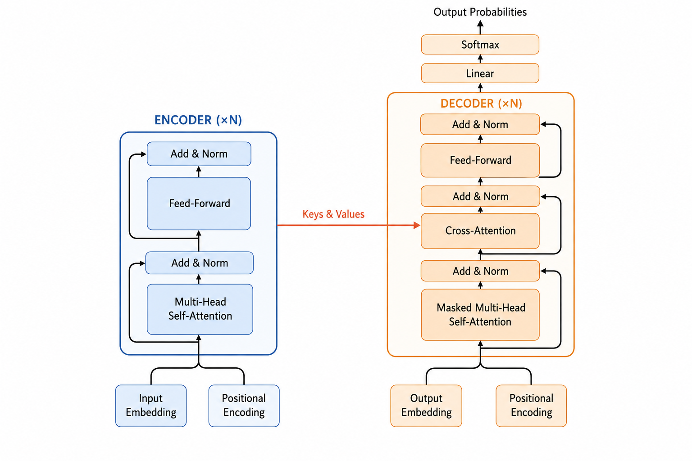
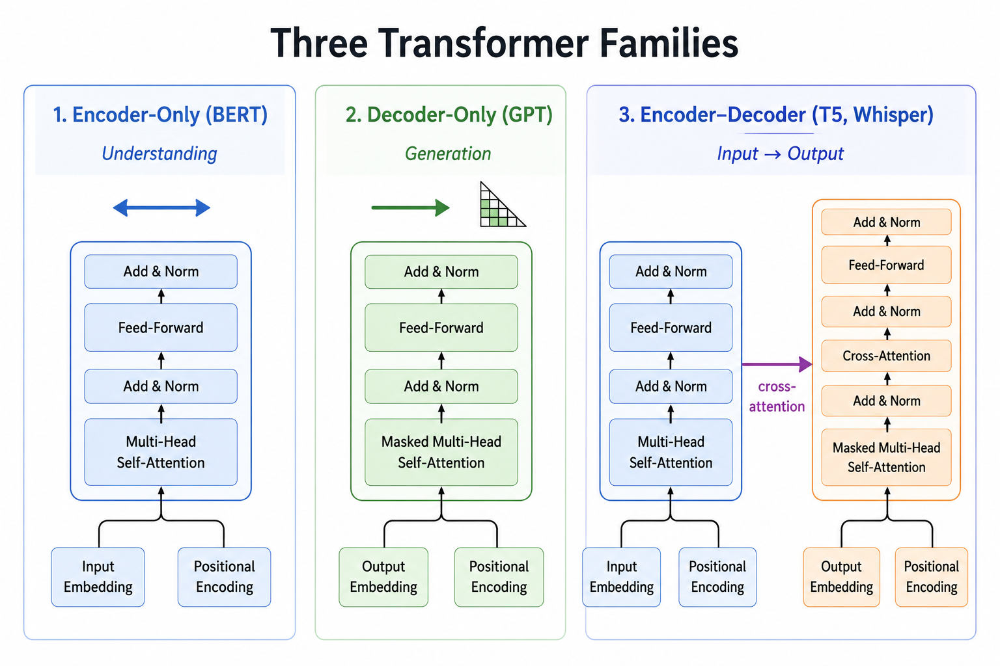

# Encoder-Decoder Architecture
> Assembling every piece from Topics 1–4 into the machine that started the revolution

**What you will learn:** How Topics 1–4 combine into the complete Transformer, what the encoder and decoder stacks each do, why the decoder needs three sub-layers and the encoder two, how the three kinds of attention work together, and why this design powers translation, summarization, and speech.

---

## 🌟 The Story That Started It All

By mid-2017, Vaswani and his co-authors had every component: self-attention (Topic 2), multi-head attention (Topic 3), and positional encoding (Topic 4). One question remained — *how do you wire these parts into a model that reads one sequence and writes another?*

Their answer, the most-cited diagram in modern AI, was a two-tower design: an **encoder** that reads the whole source at once into rich representations, and a **decoder** that generates the target one token at a time while consulting both its own past output and the encoder's summary. No recurrence, no convolution — just attention, stacked. This is "Attention Is All You Need."

> 🖼️ 
*Source: [Generated using ChatGPT (OpenAI)]*

---

## 1. What is the Problem It Solves?

Translation, summarization, and speech-to-text are **sequence-to-sequence** tasks: a variable-length input maps to a variable-length output with no one-to-one alignment. Topics 1–4 let us *represent* a sequence; the encoder–decoder lets us *transform* one into another — the encoder does pure understanding, the decoder does faithful generation.

---

## 2. What is It — In Plain Language?

Picture a translator pair: a **reader** who annotates the whole source, and a **writer** who composes the translation sentence by sentence, glancing at both the annotations and what they have already written.

The encoder is the reader — N identical layers of multi-head self-attention then a feed-forward network. The decoder is the writer — N layers too, but each has *three* steps: masked self-attention (only words already written), cross-attention (the encoder's annotations), and a feed-forward network.

**The "Aha!" Moment:** The bridge between the towers is cross-attention — Topic 1's mechanism, now multi-head. The decoder supplies the Query; the encoder supplies the Keys and Values. That single link is where source meaning flows into target generation.

---

## 3. Mathematical Formulation

Each **encoder** layer applies two residual sub-layers; each **decoder** layer applies three:

```
z   = LayerNorm(x + SelfAttn(x))               # encoder
enc = LayerNorm(z + FFN(z))

a   = LayerNorm(y + MaskedSelfAttn(y))         # decoder
b   = LayerNorm(a + CrossAttn(Q=a, K=enc, V=enc))
dec = LayerNorm(b + FFN(b))

P(next) = softmax(dec · Wₒ)
```

| Symbol | Meaning |
|--------|---------|
| **x / y** | Encoder / decoder input (embedding + positional encoding) |
| **enc** | Final encoder output — Keys & Values for cross-attention |
| **FFN** | Position-wise feed-forward: max(0, xW₁+b₁)W₂+b₂ |
| **+ / LayerNorm** | Residual skip + normalization (the *Add & Norm* wrapper) |
| **Wₒ** | Final projection from d_model to vocabulary logits |

**What this tells us:** Every sub-layer is wrapped in *Add & Norm*, letting gradients flow through deep stacks. The decoder mask enforces causality; cross-attention is the only place the towers meet.

---

## 4. How It Works — Step by Step

**Example:** Translating "The cat sat" → "Le chat s'est assis"

**Step 1:** Embed the source, add positional encoding, feed it into the encoder stack.
**Step 2:** Each encoder layer refines tokens via self-attention + FFN; the last outputs `enc`.
**Step 3:** The decoder embeds the target-so-far (starting with a start token).
**Step 4:** Masked self-attention lets each target token attend only to earlier ones.
**Step 5:** Cross-attention queries `enc`, pulling in the relevant source words.
**Step 6:** FFN → linear → softmax gives the next token; repeat until an end token.

> 🔍 *Real-world connection: this loop runs inside Google Translate and OpenAI's Whisper.*

---

## 5. The Three Transformer Families — Before and After

| Aspect | Encoder-only (BERT) | Decoder-only (GPT) | Encoder–Decoder |
|--------|---------------------|--------------------|------------------|
| **Direction** | Bidirectional | Causal | Encode + causal decode |
| **Cross-attention** | None | None | Yes — the bridge |
| **Best for** | Understanding | Generation | Input → different output |

> 🖼️ 
*Source: [Generated using ChatGPT (OpenAI)]*

---

## 6. Real World Applications

**1. Original Transformer (2017)** — State-of-the-art WMT English–German/French translation, training far faster than RNNs.

**2. T5 (Google, 2020)** — Casts every NLP task as text-to-text, unifying translation, summarization, and Q&A.

**3. Whisper (OpenAI, 2022)** — Encodes audio frames, decodes text — multilingual speech as clean seq2seq.

---

## 7. Key Assumptions and Limitations

| Limitation | Description |
|------------|-------------|
| **Two full stacks** | More compute than a single-tower model of similar depth |
| **Quadratic cost** | Both stacks still pay the O(n²) attention cost of Topics 2–3 |
| **Sequential decoding** | Generation emits one token at a time |
| **Encoder dependence** | Decoder quality hinges on the encoder via cross-attention |

---

## 8. When to Use / When Not to Use

| ✅ Use encoder–decoder when | ❌ Consider alternatives when |
|------------------------------|-------------------------------|
| Input and output are different sequences | Pure understanding → encoder-only (BERT) |
| Output length differs from input | Open-ended generation → decoder-only (GPT) |
| You condition on a full source | One tower already suffices |

---

## 9. Implementation Overview

| Approach | Tool | What It Builds |
|----------|------|----------------|
| **Scratch** | NumPy | Encoder/decoder layers, Add & Norm, FFN, all three attention types |
| **Library** | PyTorch | `torch.nn.Transformer` — full batched encoder–decoder |

```python
import torch.nn as nn
model = nn.Transformer(d_model=64, nhead=8, num_encoder_layers=2,
                       num_decoder_layers=2, batch_first=True)
out = model(src, tgt, tgt_mask=tgt_causal_mask)
```

---

## 10. Top 5 Interview Questions

1. **Why three decoder sub-layers but two encoder?** — The decoder adds cross-attention; the encoder has no second sequence to attend to.
2. **The three kinds of attention?** — Encoder self, masked decoder self, encoder–decoder cross.
3. **What do Add & Norm do?** — Residuals carry gradients past sub-layers; LayerNorm stabilizes activations — enabling deep stacks.
4. **Where does source meet target?** — Only in cross-attention: decoder = Query, encoder = Keys & Values.
5. **How do the families differ?** — Understanding (BERT), generation (GPT), conditioned generation bridging both (T5, Whisper).

---

## 11. Quick Reference Table

| Item | Detail |
|------|--------|
| **Introduced in** | Vaswani et al., 2017 |
| **Encoder layer** | Self-attn → Add&Norm → FFN → Add&Norm |
| **Decoder layer** | Masked self-attn → cross-attn → FFN (each + Add&Norm) |
| **Attention types** | Encoder self, decoder masked self, cross |
| **Output head** | Linear → softmax over vocabulary |
| **Modern examples** | T5, BART, Whisper |

---

## 12. References & Further Reading

1. [Vaswani et al. 2017 — Attention Is All You Need](https://arxiv.org/abs/1706.03762)
2. [The Illustrated Transformer — Jay Alammar](https://jalammar.github.io/illustrated-transformer/)
3. [The Annotated Transformer — Harvard NLP](https://nlp.seas.harvard.edu/2018/04/03/attention.html)
4. [T5: Exploring the Limits of Transfer Learning](https://arxiv.org/abs/1910.10683)
5. [Whisper: Robust Speech Recognition](https://arxiv.org/abs/2212.04356)
