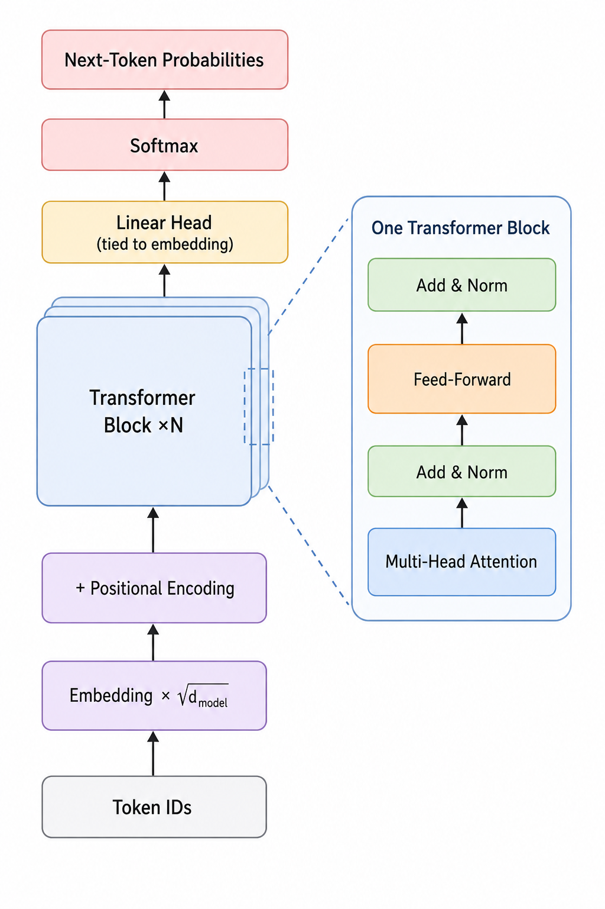
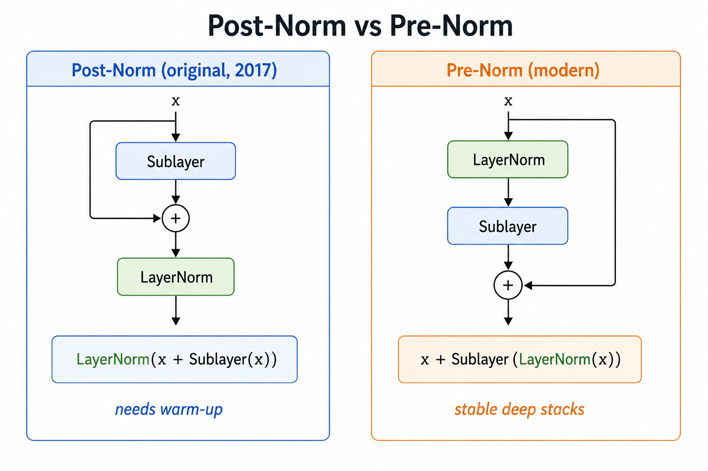

# Transformer Architecture
> Zooming out from the two towers to the whole machine — every component, one data path

**What you will learn:** How Topics 1–5 assemble into the complete Transformer, what the *non-attention* components do (embeddings and their √d_model scaling, the position-wise feed-forward network, the residual + LayerNorm "Add & Norm" wrapper, and the weight-tied output head), how N identical blocks stack, and how raw token IDs become a next-token probability.

---

## 🌟 The Story That Started It All

Topic 5 connected the encoder and decoder towers. But a Transformer is more than attention — about two-thirds of every block's parameters live in a feed-forward network, and it only trains thanks to residual connections, layer normalization, and embedding scaling. *Attention Is All You Need* specified the whole machine: N = 6 identical blocks, d_model = 512, 8 heads, a 2048-wide FFN, a residual around every sub-layer, and a projection tied to the embedding. This topic steps back to see that complete machine — the parts that are *not* attention, and how they form one forward pass.

> 🖼️ 
*Source: [Generated using ChatGPT (OpenAI)]*

---

## 1. What is the Problem It Solves?

Topic 5 wired two towers together; what was missing is the *complete specification* — how does a sequence of token IDs become a probability over the next token? The Transformer is that recipe: embeddings turn IDs into vectors, positional encoding adds order, stacked attention + FFN blocks build understanding, and an output head turns final vectors into vocabulary probabilities — all with no recurrence, fully in parallel.

---

## 2. What is It — In Plain Language?

Think of an assembly line. Tokens enter as bare IDs. The embedding layer stamps each with a learned vector (scaled by √d_model so it isn't drowned out by the positional encoding added next). The sequence passes through N identical stations, each doing two jobs: mix information across tokens (attention), then process each token alone (the FFN). Around every job is a bypass lane — the residual — plus a normalizer. One final projection turns each vector into vocabulary scores.

**The "Aha!" Moment:** The feed-forward network — two linear layers with a ReLU between, applied identically at every position — is where much of a Transformer's knowledge lives. Attention decides *what to mix*; the FFN decides *what to do with it*. Remove it and the model loses most of its capacity.

---

## 3. Mathematical Formulation

The complete forward pass, from token IDs to next-token probabilities:

```
E  = Embedding[tokens] · √d_model        # look up + scale
X  = E + PE                              # add positional encoding (Topic 4)

# repeat for each of the N blocks:
H  = LayerNorm(X + MultiHeadAttn(X))     # Add & Norm  (sub-layer 1)
X  = LayerNorm(H + FFN(H))               # Add & Norm  (sub-layer 2)

FFN(x) = max(0, xW₁ + b₁)W₂ + b₂
logits = X · Wₑᵀ                          # output head (tied to embedding)
P      = softmax(logits)
```

| Symbol | Meaning |
|--------|---------|
| **Embedding** | Learned table mapping token IDs to d_model-dim vectors |
| **√d_model** | Scaling so embeddings match positional encodings in size |
| **PE** | Positional encoding (Topic 4) |
| **LayerNorm(x + Sublayer(x))** | The *Add & Norm* wrapper around every sub-layer |
| **FFN** | Position-wise feed-forward: two linear layers, ReLU between |
| **N** | Number of stacked identical blocks (6 in the base model) |
| **Wₑᵀ** | Output projection, often tied to the embedding matrix |

**What this tells us:** Every block has the identical shape, so the model is one design repeated N times. The residual `X +` term gives gradients a highway from output to input — what makes deep stacks trainable. Tying Wₑ to the embedding saves parameters and links input and output spaces.

---

## 4. How It Works — Step by Step

**Example:** Predicting the next word after "The cat sat on the"

**Step 1:** Map each token to its ID, look up its embedding, multiply by √d_model.
**Step 2:** Add the positional encoding for each slot.
**Step 3:** Block 1 — attention mixes context across tokens, then Add & Norm.
**Step 4:** Same block — the FFN transforms each token vector alone, then Add & Norm.
**Step 5:** Repeat through all N blocks; representations grow richer.
**Step 6:** Project the last position through Wₑᵀ and softmax → a vocabulary distribution (e.g., "mat").

> 🔍 *Real-world connection: this pipeline, scaled to billions of parameters, produces every token from GPT and Claude.*

---

## 5. Post-Norm vs Pre-Norm — Before and After

| Aspect | Post-Norm (original, 2017) | Pre-Norm (modern) |
|--------|----------------------------|-------------------|
| **LayerNorm placement** | After the residual add | Inside, before the sub-layer |
| **Formula** | LayerNorm(x + Sublayer(x)) | x + Sublayer(LayerNorm(x)) |
| **Training stability** | Needs careful warm-up | Stable, trains deep stacks easily |
| **Used in** | Original Transformer, BERT | GPT-2 onward, LLaMA, most modern LLMs |

> 🖼️ 
*Source: [Generated using ChatGPT (OpenAI)]*

---

## 6. Real World Applications

**1. The Original Transformer (2017)** — Two configs from one recipe: *base* (N=6, d_model=512, ~65M params) and *big* (d_model=1024), both the identical block stacked.

**2. BERT and GPT** — The *same* block, specialized: BERT stacks encoder blocks (bidirectional); GPT stacks decoder blocks (causal mask). The architecture is shared; only masking and direction differ.

**3. Modern LLMs (GPT-3, LLaMA)** — The same components scaled to 96+ blocks and 12k-wide models, with pre-norm, RMSNorm, and rotary positions — but the block is recognizably the 2017 design.

---

## 7. Key Assumptions and Limitations

| Limitation | Description |
|------------|-------------|
| **FFN dominates parameters** | The position-wise FFN holds ~2/3 of each block's weights, so models are memory-heavy |
| **Fixed depth and width** | N, d_model, and heads are set before training; changing them means retraining |
| **Quadratic attention remains** | Stacking blocks does not remove the O(n²) cost from Topics 2–3 |
| **Post-norm is finicky** | The original post-norm design needs learning-rate warm-up to train stably |

---

## 8. When to Use / When Not to Use

| ✅ Use the full Transformer when | ❌ Consider alternatives when |
|----------------------------------|-------------------------------|
| You need a general-purpose sequence model | The task is tiny and a small RNN/CNN suffices |
| You will scale depth/width for more capacity | Memory is too tight for the FFN's parameter load |
| You want one architecture reusable across tasks | Sequences are so long that O(n²) is prohibitive |

---

## 9. Implementation Overview

| Approach | Tool | What It Builds |
|----------|------|----------------|
| **Scratch** | NumPy | Embedding + scaling, positional encoding, the block (attn + FFN + Add & Norm), N-stack, tied head |
| **Library** | PyTorch | `nn.TransformerEncoder` of `nn.TransformerEncoderLayer` + embedding + LM head |

```python
import torch.nn as nn
layer = nn.TransformerEncoderLayer(d_model=512, nhead=8, dim_feedforward=2048,
                                   norm_first=True, batch_first=True)   # pre-norm
model = nn.TransformerEncoder(layer, num_layers=6)
```

---

## 10. Top 5 Interview Questions

1. **Walk through the full forward pass.** — IDs → embedding × √d_model → + positional encoding → N blocks (attention + Add&Norm, then FFN + Add&Norm) → linear head → softmax.
2. **Why scale embeddings by √d_model?** — To keep embedding magnitudes comparable to the positional encodings, so neither dominates.
3. **What does the FFN do?** — A per-position two-layer MLP holding most of the block's parameters and learned knowledge.
4. **Post-norm vs pre-norm?** — Post-norm normalizes after the residual (original, needs warm-up); pre-norm normalizes inside the sub-layer (modern, trains deep stacks stably).
5. **What is weight tying?** — Sharing the embedding matrix with the output projection — fewer parameters, linked input/output spaces.

---

## 11. Quick Reference Table

| Item | Detail |
|------|--------|
| **Introduced in** | Vaswani et al., 2017 — base config N=6, d_model=512, h=8, d_ff=2048 |
| **One block** | Attention → Add&Norm → FFN → Add&Norm |
| **Sub-layer wrapper** | LayerNorm(x + Sublayer(x)) (post-norm) |
| **Non-attention parts** | Embedding + √d_model scaling, FFN, residual+norm, output head |
| **FFN share** | ~2/3 of each block's parameters |
| **Output head** | Linear → softmax, often weight-tied to the embedding |
| **Modern variants** | Pre-norm, RMSNorm, rotary positions (RoPE) |
| **Leads to** | Pretraining objectives and full LLM training |

---

## 12. References & Further Reading

1. [Vaswani et al. 2017 — Attention Is All You Need](https://arxiv.org/abs/1706.03762)
2. [The Illustrated Transformer — Jay Alammar](https://jalammar.github.io/illustrated-transformer/)
3. [The Annotated Transformer — Harvard NLP](https://nlp.seas.harvard.edu/2018/04/03/attention.html)
4. [On Layer Normalization in the Transformer (Pre-Norm)](https://arxiv.org/abs/2002.04745)
5. [Using the Output Embedding to Improve LMs (Weight Tying)](https://arxiv.org/abs/1608.05859)
