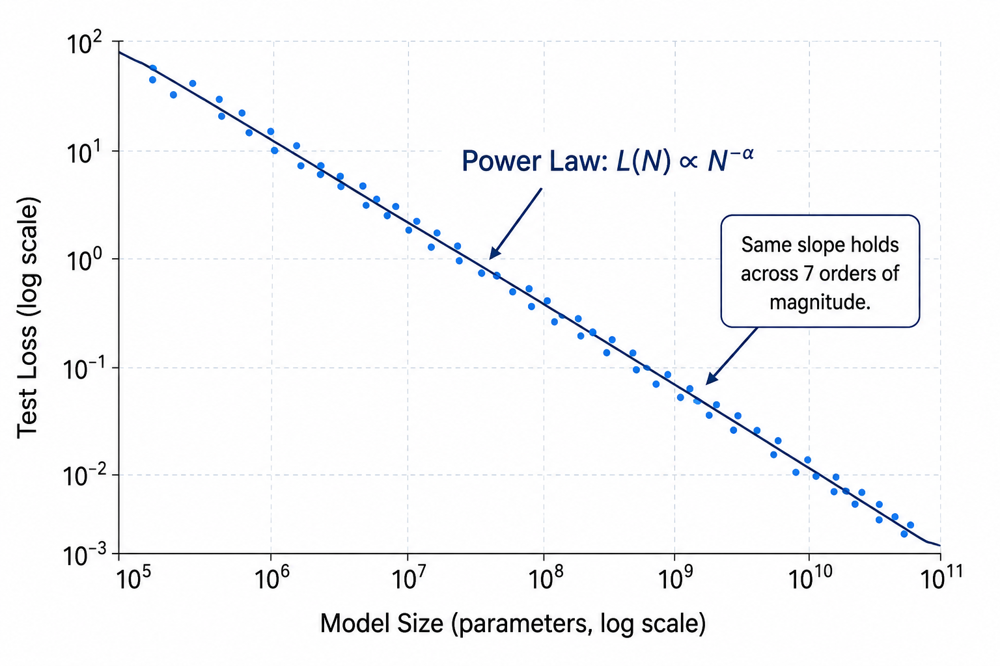
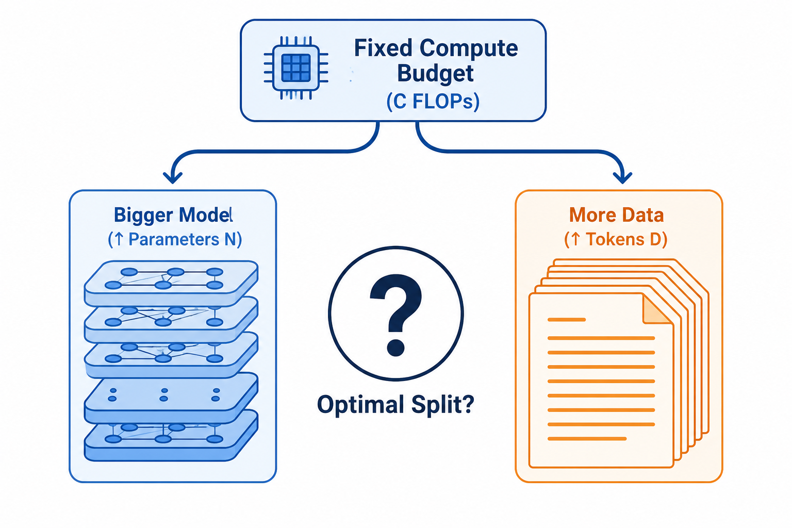
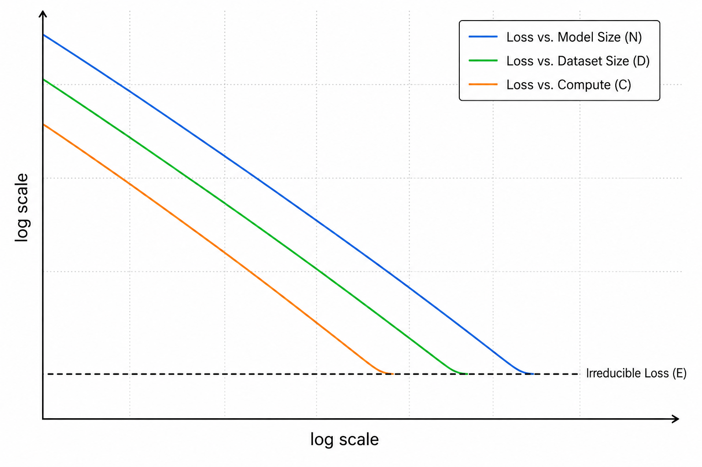
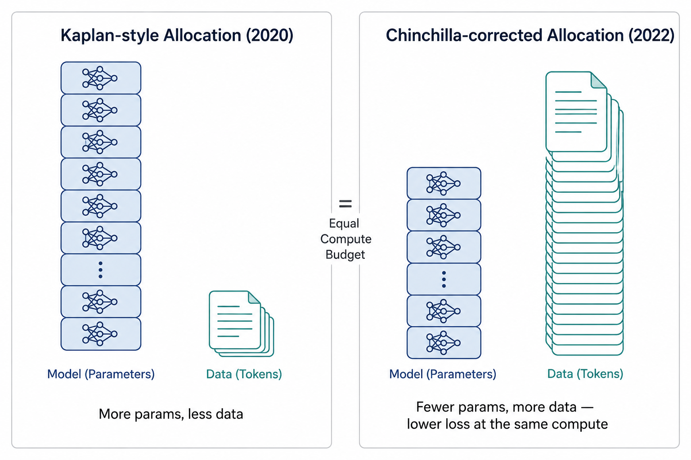
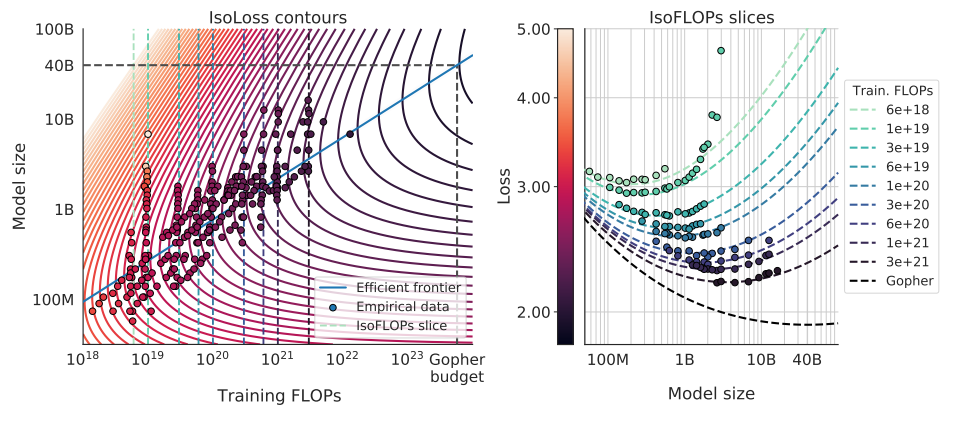

# Scaling Laws
> How a straight line on a log-log plot taught labs how big to build a model — before they ever trained it

**What you will learn:** Why test loss follows a predictable power law in model size, data size, and compute, what the Chinchilla loss surface L(N, D) actually says, how to derive the compute-optimal split between parameters and data, why GPT-3 and Chinchilla disagree about that split, and why "compute-optimal" is not the same question as "what should we actually ship."

---

## 🌟 The Story That Started It All

It is 2020. OpenAI's Jared Kaplan and his co-authors have trained dozens of small transformer language models — from a few thousand parameters to over a billion — and plotted each one's test loss against its size on a log-log graph. The points fall on a near-perfect straight line, spanning seven orders of magnitude. The same straight-line behavior shows up when they plot loss against dataset size, and against total training compute.

That should not happen. Deep learning is notoriously empirical — architectures that shine at one scale often fall apart at another. But here, a simple power law seems to govern how good a language model gets, almost independent of the exact architecture. Kaplan's team publishes "Scaling Laws for Neural Language Models," and OpenAI uses the resulting curves to plan GPT-3 *before* training it — deciding parameter count and data volume in advance, by extrapolating a line.

Two years later, DeepMind's Jordan Hoffmann and co-authors revisit the question with a more careful experimental design, and find something uncomfortable: Kaplan's team had answered the right question slightly wrong. At any fixed compute budget, GPT-3-era models were trained with far too many parameters and far too little data. Their model, **Chinchilla** — 4x smaller than DeepMind's own Gopher but trained on 4x more tokens, for the *same* compute budget — beats it decisively. This one correction reshaped how nearly every major lab since has decided how big to make a model versus how much data to feed it.

> 🖼️ 
*Source: [Generated using ChatGPT (OpenAI)]*

---

## 1. What is the Problem Scaling Laws Solve?

Before scaling laws, deciding how big to make a model was largely guesswork. A team with a fixed compute budget had no principled way to know: should that budget buy a bigger model, or more training data, or more training steps? Training a candidate architecture at full scale just to find out is enormously expensive — a single misallocated run can cost millions of dollars in compute.

The analogy: imagine being handed a fixed amount of money to spend on a child's growth — more food, or more vitamins, or more sleep — with no idea which lever actually moves height, and no way to test it except by raising an actual child to adulthood and checking. Scaling laws are what happens when you instead study thousands of children's growth curves, find the reliable underlying pattern, and use it to predict the outcome of choices you have not made yet.

This is the **allocation problem**: a fixed compute budget C can be spent on a bigger model (more parameters, N) or more data (more tokens, D), and without a model of how loss depends on both, there is no way to know which choice is better before paying for it.

> 🖼️ 
*Source: [Generated using ChatGPT (OpenAI)]*

---

## 2. What Are Scaling Laws — In Plain Language?

A scaling law is an empirical, remarkably smooth relationship: as you increase model size N, dataset size D, or total compute C — while keeping the other factors from becoming the bottleneck — test loss decreases following a power law. Plotted on log-log axes, this shows up as a straight line.

Think of it like a fuel-efficiency curve for a car. You don't need to drive every possible car on every possible road to know roughly how efficiency scales with engine size and weight — a handful of careful measurements at small and medium scale reveal a curve reliable enough to extrapolate to a car you haven't built yet.

**The "Aha!" Moment:**

Kaplan's team trains models from roughly 10⁵ to 10⁹ parameters, fits a line through the loss-vs-size points, and that line correctly predicts the loss of GPT-3 — a model 100x larger than anything in the fitted range — before it was trained. Two years later, Hoffmann's team performs a more careful version of the same exercise and finds a different optimal answer: for a fixed compute budget, model size and dataset size should grow at close to the *same* rate, not with size dominating. Both teams are using the same underlying idea — a power law fit lets you extrapolate — but they reach different conclusions about the *optimal allocation*, because the second study controlled for a subtle fitting bias the first one had not.

This is a scaling law: **a power-law relationship between a model's performance and the resources spent to produce it, precise enough to extrapolate decisions you have not yet paid for.**

> 🖼️ 
*Source: [Generated using ChatGPT (OpenAI)]*

---

## 3. Mathematical Formulation

In isolation, loss as a function of model size alone (with data effectively unlimited) follows:

```
L(N) = (Nc / N)^α          (and similarly L(D) = (Dc / D)^β, holding N unlimited)
```

The more general parametric form used by Hoffmann et al. (2022) combines both terms plus an irreducible floor:

```
L(N, D) = E + A / Nᵅ + B / Dᵝ
```

Training compute is approximately:

```
C ≈ 6 · N · D
```

Minimizing L(N, D) subject to a fixed compute budget C = 6ND gives the compute-optimal allocation:

```
N_opt(C) = G · (C/6)ᵃ          where a = β / (α + β)
D_opt(C) = (C/6) / N_opt(C)    where b = α / (α + β)
G = (αA / βB)^(1/(α+β))
```

| Symbol | Meaning |
|--------|---------|
| **N** | Model size — number of (non-embedding) parameters |
| **D** | Dataset size — number of training tokens |
| **C** | Training compute, in FLOPs — C ≈ 6ND |
| **E** | Irreducible loss — the entropy of natural text itself; no model beats this floor |
| **A, α** | Coefficient and exponent of the "finite model size" penalty |
| **B, β** | Coefficient and exponent of the "finite data" penalty |
| **N_opt(C), D_opt(C)** | The compute-optimal parameter count and token count for a given budget C |

**What this tells us:** E is a hard floor set by the unpredictability of language itself — adding parameters or data forever shrinks the *other two* terms toward zero but never E. The exponents α and β determine how the optimal budget should be split: Kaplan's original fits implied α should dominate (favoring bigger models), while Hoffmann's more careful joint fit found α ≈ 0.34 and β ≈ 0.28 — close enough that N and D should scale at nearly the same rate as compute grows.

---

## 4. How It Works — Step by Step

**Example:** A lab has a fixed budget of C = 1×10²¹ FLOPs and wants to know the best model size.

**Step 1:** Run a set of small, cheap training experiments at varied (N, D) pairs and record final loss for each.

**Step 2:** Fit the parametric surface L(N, D) = E + A/Nᵅ + B/Dᵝ to the observed (N, D, loss) triples — typically via nonlinear least squares, jointly across all the data (not by holding one variable fixed and slicing the other, which biases the fitted exponents).

**Step 3:** Compute a = β/(α+β) and G = (αA/βB)^(1/(α+β)) from the fitted exponents and coefficients.

**Step 4:** Compute N_opt = G · (C/6)ᵃ for the actual budget C = 1×10²¹.

**Step 5:** Compute D_opt = (C/6) / N_opt — the token count that pairs with N_opt at this budget.

**Step 6:** Train the real, expensive model at (N_opt, D_opt) — the allocation the fitted curve predicts will minimize loss for that exact compute budget.

> 🔍 *Real-world connection: this is precisely the calculation behind DeepMind's decision to train the 70-billion-parameter Chinchilla on 1.4 trillion tokens, rather than building a Gopher-sized 280-billion-parameter model on far less data, for the same compute spend.*

---

## 5. Kaplan (2020) vs. Chinchilla (2022) — Before and After

| Aspect | Kaplan-style Scaling (Before) | Chinchilla-corrected Scaling (After) |
|--------|-------------------------------|----------------------------------------|
| **Fitting method** | Exponents estimated from single-axis slices | Exponents estimated by jointly fitting the full (N, D, loss) surface |
| **Optimal split as compute grows** | Favors parameters — N should grow much faster than D | N and D should grow at close to the same rate |
| **Resulting model shape** | Very large, comparatively data-light (e.g. GPT-3: 175B params, 300B tokens) | Smaller, comparatively data-rich (e.g. Chinchilla: 70B params, 1.4T tokens) |
| **Outcome at matched compute** | Larger model, higher loss | Smaller model, lower loss, cheaper to run |
| **Influence on later models** | Set the template for the GPT-3 era | Adopted by LLaMA and most subsequent open LLMs |

> 🖼️ 
*Source: [Generated using ChatGPT (OpenAI)]*

---

## 6. Real World Applications

**1. GPT-3 (OpenAI, 2020)**
Designed using the original Kaplan-era scaling laws: 175 billion parameters trained on roughly 300 billion tokens — a configuration that, in hindsight, spent its compute budget more on size than the later Chinchilla analysis would recommend.

**2. Chinchilla (DeepMind, 2022)**
A 70-billion-parameter model trained on 1.4 trillion tokens, using roughly the same compute budget as DeepMind's own 280-billion-parameter Gopher. Chinchilla outperformed Gopher across the board, demonstrating the corrected scaling law directly rather than just on paper.

**3. LLaMA and Open LLMs (Meta, and successors)**
Meta's LLaMA models were explicitly trained following Chinchilla-style guidance on parameter-to-token ratios, and later versions deliberately *overtrained* relative to the strict compute-optimal point — accepting a slightly higher training cost in exchange for a smaller, cheaper-to-serve model, since inference cost recurs on every single query a deployed model receives.

> 🖼️ 
*Source: [Source from internet]*

---

## 7. Key Assumptions and Limitations

| Limitation | Description |
|------------|--------------|
| **Empirical fit, not first-principles theory** | Power laws describe an observed regularity; they are not derived from a theory of why language modeling behaves this way, and they can break down outside the fitted range |
| **Compute-optimal ≠ inference-optimal** | The formula minimizes training loss for a fixed training budget — it ignores the cost of running the model afterward, which is why production systems often deviate from it deliberately |
| **Sensitive to fitting methodology** | Estimating exponents from single-axis slices (holding one variable "large") can bias results if that variable isn't truly non-bottlenecking — part of why Kaplan and Chinchilla reached different conclusions |
| **Assumes unique, fixed-quality data** | The laws are fit assuming each training token is seen roughly once from a stable data distribution; repeated epochs or major data-quality shifts can change the constants |
| **Says nothing about emergent capabilities** | A smooth loss curve does not predict the sudden appearance of qualitatively new abilities sometimes observed at larger scale |

---

## 8. When to Use / When Not to Use

| ✅ Scaling laws are the right tool when | ❌ Consider alternatives when |
|--------------------------------------------|-------------------------------|
| Planning a large, expensive training run and choosing N vs. D ahead of time | The experiment is small enough that noise dominates any fitted curve |
| Comparing architectures cheaply at small scale before committing to a large one | The data available is severely limited or will be repeated many epochs |
| Deciding how to split a fixed compute budget between model size and data | The goal is predicting a specific emergent capability rather than overall loss |
| Justifying a training plan with a quantitative, falsifiable prediction | Inference cost over the model's lifetime matters more than training-time loss — use inference-optimal analysis instead |

---

## 9. Implementation Overview

| Approach | Tool | What It Builds |
|----------|------|------------------|
| **From Scratch** | NumPy | Single-axis log-log linear regression to estimate one exponent at a time |
| **Library** | SciPy | `scipy.optimize.curve_fit` — joint nonlinear least-squares fit of the full L(N, D) surface |

```python
import numpy as np
from scipy.optimize import curve_fit

def surface(X, E, A, B, alpha, beta):
    N, D = X
    return E + A / N**alpha + B / D**beta

# Jointly fit all five coefficients to observed (N, D, loss) triples
popt, _ = curve_fit(surface, (N_vals, D_vals), loss_vals, p0=[1.5, 100, 100, 0.3, 0.3])
```

---

## 10. Top 5 Interview Questions

1. **What is a scaling law, and why does it matter for training large models?**
   - An empirical power-law relationship between test loss and model size, dataset size, or compute
   - It lets a team predict the performance of an expensive, not-yet-trained model by extrapolating from cheap, small-scale experiments
   - This turns "how big should we build it?" from a guess into a calculation, before any expensive compute is spent

2. **What is the key difference between the Kaplan (2020) and Chinchilla (2022) scaling laws?**
   - Kaplan's fits implied model size should grow much faster than dataset size as compute increases
   - Hoffmann et al.'s more careful, jointly-fit analysis found model size and dataset size should grow at close to the same rate
   - This means many GPT-3-era models were undertrained relative to their parameter count — too big, too little data, for their compute budget

3. **What does the irreducible loss term E represent, and why can't a model beat it?**
   - E represents something like the inherent entropy/unpredictability of natural language itself
   - No amount of additional parameters or data can push loss below E — the A/Nᵅ and B/Dᵝ terms shrink toward zero, but E does not
   - This sets a theoretical floor on how good any model of this kind can ever get on this objective

4. **What is the difference between compute-optimal and inference-optimal training?**
   - Compute-optimal minimizes training loss for a fixed one-time training compute budget
   - Inference-optimal also accounts for the cost of serving the model on every future query, which recurs indefinitely
   - In practice, this often means deliberately training a smaller model on more tokens than the strict compute-optimal formula recommends, because the smaller model is cheaper to run for its entire deployed lifetime

5. **Where do scaling laws break down or need to be used carefully?**
   - Single-axis exponent estimates can be biased if the "held large" variable isn't actually in a non-bottlenecked regime
   - The fitted constants are specific to an architecture, tokenizer, and data distribution — they don't automatically transfer to a substantially different setup
   - Smooth loss curves do not predict sudden, qualitatively new emergent capabilities that sometimes appear at larger scale

---

## 11. Quick Reference Table

| Item | Detail |
|------|--------|
| **Proposed by** | Kaplan et al., 2020 (OpenAI); corrected by Hoffmann et al., 2022 (DeepMind, "Chinchilla") |
| **Problem solved** | Principled allocation of a fixed compute budget between model size and data |
| **Core formula** | L(N, D) = E + A/Nᵅ + B/Dᵝ |
| **Compute relation** | C ≈ 6ND |
| **Chinchilla exponents** | α ≈ 0.34, β ≈ 0.28 — implies N and D should scale at close to the same rate |
| **Key real-world result** | Chinchilla (70B params, 1.4T tokens) beat Gopher (280B params, 300B tokens) at matched compute |
| **Key caveat** | Compute-optimal is a training-cost answer, not an inference-cost answer |
| **Leads to** | Practical guidance behind LLaMA and most modern large language model training plans |

---

## 12. References & Further Reading

1. [Kaplan et al. 2020 — Scaling Laws for Neural Language Models](https://arxiv.org/abs/2001.08361)
2. [Hoffmann et al. 2022 — Training Compute-Optimal Large Language Models ("Chinchilla")](https://arxiv.org/abs/2203.15556)
3. [Touvron et al. 2023 — LLaMA: Open and Efficient Foundation Language Models](https://arxiv.org/abs/2302.13971)
4. [Henighan et al. 2020 — Scaling Laws for Autoregressive Generative Modeling](https://arxiv.org/abs/2010.14701)
5. [The Annotated Transformer — Harvard NLP](https://nlp.seas.harvard.edu/2018/04/03/attention.html)
