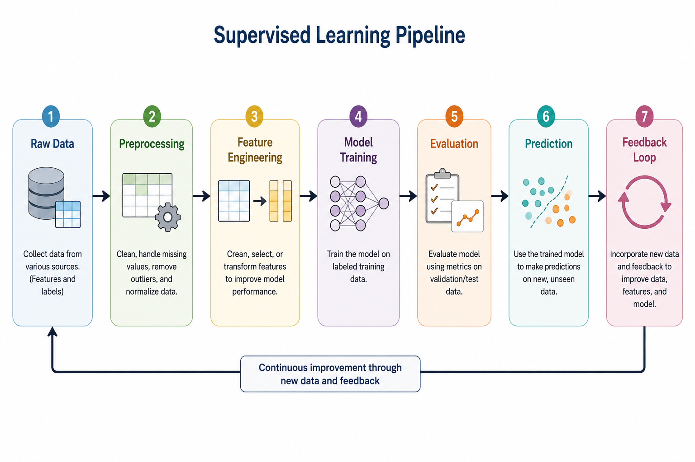

# Introduction to Supervised Learning
> Teaching machines by example — the foundation of modern AI

**What you will learn:** In this module, you will understand what supervised learning is, how it works conceptually, and when to use it. You will also learn to distinguish between regression and classification, and understand the full ML training pipeline from raw data to predictions.

---

## 1. What is Supervised Learning?

Supervised learning is the branch of machine learning where an algorithm learns from **labeled data** — data where the correct answer (output) is already known. The model is trained on input-output pairs and learns to map new inputs to their correct outputs.

Think of it like learning to cook from a recipe book. The recipe (training data) tells you exactly what ingredients (inputs) lead to what dish (output). After studying enough recipes, you can confidently cook a new dish you have never seen before. The more recipes you study, the better you get.

The word "supervised" comes from the idea of a teacher supervising a student. The "teacher" provides correct answers (labels) during training, and the model learns by minimizing its mistakes on those answers.

---

## 2. Mathematical Formulation

The core idea of supervised learning is to find a function **f** that maps inputs to outputs:

```
ŷ = f(X)
```

| Symbol | Meaning |
|--------|---------|
| **X** | Input feature matrix — the data we feed in (e.g., house size, number of rooms) |
| **y** | True label / actual output (e.g., actual house price) |
| **ŷ** | Predicted output — what the model thinks the answer is |
| **f** | The function the model learns from training data |
| **L(y, ŷ)** | Loss function — measures how wrong the prediction is |

The model learns **f** by minimizing the loss function. For regression tasks, the most common loss is **Mean Squared Error (MSE)**:

```
L(y, ŷ) = (1/n) × Σ(yᵢ - ŷᵢ)²
```

**What this tells us:** Find the function f such that predictions ŷ are as close as possible to true values y, on average, across all training examples. The smaller the loss, the better the model.

---

## 3. How It Works — Step by Step

1. **Collect labeled data** — Gather input-output pairs (e.g., email text → spam/not spam)
2. **Split the data** — Divide into training set (~80%) and test set (~20%) to evaluate fairly
3. **Choose a model** — Select an algorithm suited to your task (Linear Regression, Decision Tree, etc.)
4. **Train the model** — Feed training data; model adjusts internal parameters to minimize loss
5. **Evaluate** — Run predictions on the unseen test set and measure performance
6. **Predict** — Deploy the trained model to make predictions on real-world new data

> 🔍 *Analogy: A student (model) studies past exam papers (training data) and then takes a brand new exam (test data) to prove they truly learned — not just memorized.*

> 🖼️ 
*Source: [Generated using ChatGPT (OpenAI)]*

## 4. Key Assumptions

| Assumption | What Happens if Violated |
|------------|--------------------------|
| Labels are correct and accurate | Model learns wrong patterns — garbage in, garbage out |
| Training data is representative of real-world data | Model fails to generalize; performs well in training, fails in production |
| Features (inputs) are relevant to the target | Model has poor predictive power regardless of its complexity |
| Data points are i.i.d. (independent, identically distributed) | Model may pick up on spurious correlations that don't exist in reality |
| Enough training examples exist | Model overfits — memorizes training data instead of learning patterns |

---

## 5. When to Use / When Not to Use

| ✅ Use Supervised Learning When | ❌ Avoid When |
|-------------------------------|---------------|
| You have labeled training data available | Labels are unavailable or too expensive to collect |
| You want to predict a specific, known output | You want to discover hidden structure in unlabeled data |
| The task is regression or classification | You want the model to explore and group data on its own |
| You have enough representative training examples | You have very few data points (risk of overfitting) |
| Output categories or ranges are well-defined | The problem is too open-ended for a fixed output format |

---

## 6. Implementation Overview

| Approach | Tool | How It Works |
|----------|------|-------------|
| **From Scratch** | NumPy | Manually build the model, training loop, and loss calculation |
| **Library** | Scikit-learn | `fit()` trains the model, `predict()` makes predictions automatically |

Scikit-learn follows a consistent 3-step API across all algorithms:
```python
model = AlgorithmName()       # 1. Instantiate
model.fit(X_train, y_train)   # 2. Train
predictions = model.predict(X_test)  # 3. Predict
```

The from-scratch version builds intuition about what actually happens inside `fit()` — parameter updates, loss minimization, and iteration.

---

## 7. Top 5 Interview Questions

1. **What is supervised learning? How does it differ from unsupervised learning?**
   - Supervised: labeled data, known outputs, learns mapping f(X) → y
   - Unsupervised: no labels, finds hidden structure (clustering, dimensionality reduction)

2. **What is the difference between regression and classification?**
   - Regression: predicts a continuous value (house price, temperature)
   - Classification: predicts a discrete class/category (spam vs not spam, cat vs dog)

3. **What is overfitting and how do you handle it?**
   - Model memorizes training data; performs poorly on new data
   - Fix: more training data, regularization (L1/L2), simpler model, cross-validation

4. **What is the bias-variance tradeoff?**
   - High bias → underfitting (model too simple to capture patterns)
   - High variance → overfitting (model too sensitive to training noise)
   - Goal: find the model complexity that balances both

5. **How do you evaluate a supervised learning model?**
   - Regression: MSE, RMSE, MAE, R² score
   - Classification: Accuracy, Precision, Recall, F1-Score, AUC-ROC

---

## 8. Quick Reference Table

| Item | Detail |
|------|--------|
| **Type** | Meta-category (not a single algorithm) |
| **Task Types** | Regression (continuous output), Classification (discrete output) |
| **Core Concept** | Learn f: X → y from labeled training data |
| **Time Complexity** | Depends on algorithm chosen |
| **Space Complexity** | Depends on algorithm chosen |
| **Evaluation (Regression)** | MSE, RMSE, MAE, R² |
| **Evaluation (Classification)** | Accuracy, Precision, Recall, F1, AUC-ROC |
| **Key Hyperparameters** | Algorithm-specific (learning rate, depth, k, etc.) |
| **Common Libraries** | scikit-learn, TensorFlow, PyTorch, XGBoost |

---

## 9. References & Further Reading

1. [Scikit-learn Supervised Learning Documentation](https://scikit-learn.org/stable/supervised_learning.html)
2. [Google Machine Learning Crash Course](https://developers.google.com/machine-learning/crash-course)
3. [Kaggle: Intro to Machine Learning](https://www.kaggle.com/learn/intro-to-machine-learning)
4. [StatQuest: Machine Learning Fundamentals (YouTube)](https://www.youtube.com/watch?v=Gv9_4yMHFhI)
5. [Pattern Recognition and Machine Learning — Bishop, Chapter 1](https://www.microsoft.com/en-us/research/publication/pattern-recognition-machine-learning/)
