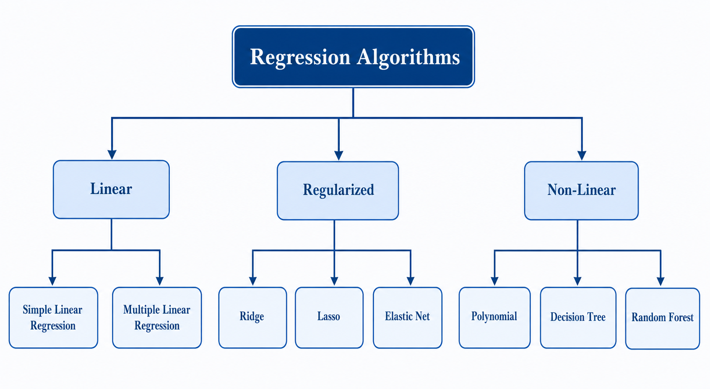

# Introduction to Regression Algorithms
> Predicting the future with numbers — the art of fitting lines to life

**What you will learn:** In this module, you will understand what regression means in machine learning, explore the family of regression algorithms, learn how to evaluate regression models, and know exactly which algorithm to pick for which real-world problem.

---

## 1. What is Regression?

Regression is a supervised learning task where the goal is to predict a **continuous numerical value** based on input features. Unlike classification, which predicts categories, regression predicts quantities — a price, a temperature, a score, a demand forecast.

Think of regression like a weather forecaster. They don't just say "it will be hot or cold" (classification) — they say "it will be 34°C tomorrow" (regression). The forecaster uses past patterns (training data) to arrive at a precise number.

Every regression algorithm essentially answers the same question: **given these inputs, what is the most likely numerical output?** What differs between algorithms is *how* they answer that question — the assumptions they make, the complexity they allow, and the constraints they impose.

---

## 2. Mathematical Formulation

The general regression problem is defined as:

```
ŷ = f(X) + ε
```

| Symbol | Meaning |
|--------|---------|
| **X** | Input feature matrix (n samples × p features) |
| **ŷ** | Predicted continuous output value |
| **f** | The function the model learns from training data |
| **ε** | Error term — irreducible noise that no model can explain |
| **y** | True continuous output (ground truth label) |

The model minimizes the **Mean Squared Error (MSE)** loss:

```
MSE = (1/n) × Σ(yᵢ - ŷᵢ)²
```

**What this tells us:** We want predicted values ŷ as close as possible to true values y. Squaring the error penalizes large mistakes more heavily than small ones — a prediction off by 10 is penalized 100x more than one off by 1.

The **R² score** tells us how much variance the model explains:

```
R² = 1 - (SS_residual / SS_total)
```

R²=1 means perfect predictions. R²=0 means the model is no better than predicting the mean every time.

---

## 3. How It Works — Step by Step

1. **Define the target** — Identify the continuous variable to predict (e.g., house price)
2. **Select features** — Choose input variables with predictive power (e.g., size, location, rooms)
3. **Choose a regression algorithm** — Based on data size, feature count, and linearity assumptions
4. **Train the model** — Model learns the best parameters to minimize prediction error on training data
5. **Evaluate on test set** — Measure MSE, RMSE, MAE, R² on unseen data
6. **Iterate** — Tune hyperparameters, engineer new features, try different algorithms

> 🔍 *Analogy: Regression is like adjusting the focus ring on a camera. You keep turning (training) until the image (prediction) is as sharp (accurate) as possible. Different lenses (algorithms) give different results for the same scene.*

> 🖼️ 
*Source: [Generated using ChatGPT (OpenAI)]*

---

## 4. Key Assumptions

| Assumption | What Happens if Violated |
|------------|--------------------------|
| Target variable is continuous | Wrong task type — switch to classification |
| Features have some correlation with target | Model has no signal to learn; predictions are random |
| Training data covers the prediction range | Model extrapolates poorly outside the training range |
| Errors (ε) are roughly normally distributed | Linear regression coefficient estimates become unreliable |
| Features are not perfectly multicollinear | Coefficients become unstable and uninterpretable |

---

## 5. When to Use / When Not to Use

| ✅ Use Regression When | ❌ Avoid When |
|----------------------|---------------|
| Target is a continuous number | Target is a category or class label |
| You need an exact numerical prediction | A range or category is sufficient |
| Relationships between features and target exist | Features have near-zero correlation with target |
| Data is tabular and structured | Data is raw images, audio, or unstructured text |
| Interpretability of coefficients matters | Black-box prediction accuracy is all that matters |

---

## 6. Implementation Overview

| Algorithm | Tool | Best For |
|-----------|------|----------|
| **Linear Regression** | NumPy / sklearn | Baseline, linear relationships, interpretability |
| **Polynomial Regression** | NumPy / sklearn | Curved, non-linear patterns in data |
| **Ridge Regression** | sklearn | Multicollinearity, many correlated features |
| **Lasso Regression** | sklearn | Feature selection, sparse high-dimensional data |
| **Elastic Net** | sklearn | Mix of Ridge + Lasso when both are needed |
| **Decision Tree Regressor** | sklearn | Non-linear relationships, no scaling needed |
| **Random Forest Regressor** | sklearn | High accuracy, robust to outliers and noise |

```python
from sklearn.linear_model import LinearRegression

model = LinearRegression()        # 1. Instantiate
model.fit(X_train, y_train)       # 2. Train — learns coefficients
y_pred = model.predict(X_test)    # 3. Predict — applies learned function
```

The from-scratch version implements the Normal Equation directly: **θ = (XᵀX)⁻¹Xᵀy**, showing exactly what `fit()` computes internally.

---

## 7. Top 5 Interview Questions

1. **What is the difference between regression and classification?**
   - Regression: continuous output (price, score, temperature) — minimizes MSE
   - Classification: discrete output (spam/ham, cat/dog) — minimizes cross-entropy
   - Same supervised framework — only the output type and loss function differ

2. **What does R² score actually mean?**
   - Proportion of variance in y that the model explains
   - R²=1: perfect; R²=0: no better than predicting the mean; negative: worse than mean
   - Always check alongside RMSE — high R² with high RMSE can still mean poor predictions

3. **When would you use Ridge over Lasso?**
   - Ridge: all features contribute, just need coefficient shrinkage (L2 penalty)
   - Lasso: many irrelevant features, want automatic feature selection (L1 penalty → zeros)
   - Elastic Net: when you want both shrinkage and sparsity simultaneously

4. **What happens when features are highly correlated (multicollinearity)?**
   - Linear regression coefficients become unstable and hard to interpret
   - Small changes in data cause large swings in coefficients
   - Fix: Ridge regression, PCA for dimensionality reduction, or drop correlated features

5. **How do you detect and fix overfitting in regression?**
   - Signs: large gap between train R² and test R², very low train MSE but high test MSE
   - Fix: regularization (Ridge/Lasso), more training data, simpler model, cross-validation

---

## 8. Quick Reference Table

| Item | Detail |
|------|--------|
| **Algorithm Type** | Supervised Learning — Regression family |
| **Output Type** | Continuous numerical value |
| **Time Complexity** | O(n×p²) for linear (Normal Equation); O(n×p×iterations) for gradient descent |
| **Space Complexity** | O(p) for linear models; O(n) for tree-based |
| **Key Metrics** | MSE, RMSE, MAE, R², Adjusted R² |
| **Key Hyperparameters** | α (regularization strength), degree (polynomial), max_depth (trees) |
| **Common Libraries** | scikit-learn, statsmodels, XGBoost, LightGBM |
| **Baseline to Always Beat** | Predicting the mean of y for every sample |

---

## 9. References & Further Reading

1. [Scikit-learn Regression Documentation](https://scikit-learn.org/stable/supervised_learning.html)
2. [Kaggle: House Prices Competition](https://www.kaggle.com/c/house-prices-advanced-regression-techniques)
3. [StatQuest: Linear Regression Clearly Explained (YouTube)](https://www.youtube.com/watch?v=nk2CQITm_eo)
4. [An Introduction to Statistical Learning — James et al. Chapter 3](https://www.statlearning.com/)
5. [Towards Data Science: Regression Algorithms Overview](https://towardsdatascience.com/introduction-to-machine-learning-algorithms-linear-regression-14c4e325882a)
