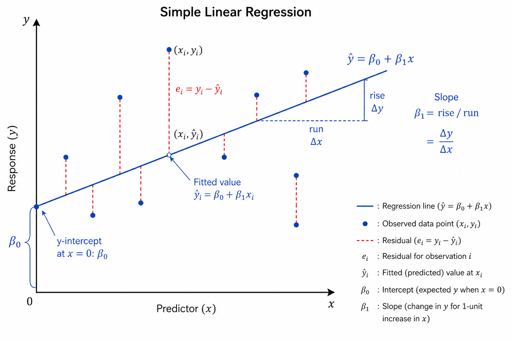

# Simple Linear Regression
> One line to rule them all — predicting a number from a single feature

**What you will learn:** In this module you will understand how Simple Linear Regression works mathematically, how the best-fit line is found using Ordinary Least Squares, what assumptions the model makes, and how to implement it from scratch and with sklearn on real-world data.

---

## 1. What is Simple Linear Regression?

Simple Linear Regression (SLR) is the most fundamental regression algorithm. It models the relationship between **one input feature (X)** and **one continuous output (y)** by fitting a straight line through the data.

Think of it like estimating someone's salary based only on their years of experience. You plot all employees on a graph (experience vs salary), draw the best possible straight line through the points, and use that line to predict the salary for a new employee with, say, 5 years of experience. The line summarizes the entire relationship in just two numbers: a slope and an intercept.

The word "simple" means one predictor variable — not that the concept is trivial. Understanding SLR deeply means understanding Ridge, Lasso, and Multiple Linear Regression by extension, because they all build on the same Ordinary Least Squares foundation.

---

## 2. Mathematical Formulation

The equation of the regression line:

```
ŷ = β₀ + β₁x
```

| Symbol | Meaning |
|--------|---------|
| **ŷ** | Predicted output value |
| **x** | Single input feature value |
| **β₀** | Intercept — value of ŷ when x = 0 |
| **β₁** | Slope — how much ŷ changes for every 1-unit increase in x |

The Ordinary Least Squares (OLS) formulas that find the optimal β₀ and β₁:

```
β₁ = Σ(xᵢ - x̄)(yᵢ - ȳ) / Σ(xᵢ - x̄)²  =  Cov(x, y) / Var(x)

β₀ = ȳ - β₁ × x̄
```

**What this tells us:** β₁ is the ratio of how x and y move together (covariance) to how much x varies on its own (variance). A large β₁ means y changes a lot when x changes a little. β₀ anchors the line so it passes through the centroid (x̄, ȳ) of the data — the average point. Together these two values fully define the best-fit line that minimizes total squared prediction error.

---

## 3. How It Works — Step by Step

1. **Plot the data** — scatter plot of x vs y to visually confirm a linear trend exists
2. **Calculate means** — compute x̄ (mean of x) and ȳ (mean of y)
3. **Calculate β₁** — covariance of x and y divided by variance of x
4. **Calculate β₀** — use β₀ = ȳ - β₁x̄ to anchor the line correctly
5. **Draw the line** — ŷ = β₀ + β₁x is now fully defined with just two numbers
6. **Predict** — plug any new x value into the equation to get ŷ
7. **Evaluate** — compute RMSE and R² on the held-out test set

> 🔍 *Analogy: OLS is like a tug of war. Every data point pulls the regression line toward itself. The OLS solution is the position where all the pulling forces are perfectly balanced — minimizing the total squared vertical distance from every point to the line.*

> 🖼️ 
*Source: [Generated using ChatGPT (OpenAI)]*


---

## 4. Key Assumptions (LINE)

| Letter | Assumption | What Happens if Violated |
|--------|------------|--------------------------|
| **L** | **L**inearity — x and y have a truly linear relationship | Model systematically under or over-predicts in certain ranges |
| **I** | **I**ndependence — observations do not influence each other | Standard errors are underestimated; coefficients become unreliable |
| **N** | **N**ormality — residuals are normally distributed around zero | Prediction intervals become inaccurate |
| **E** | **E**qual variance (Homoscedasticity) — residuals have constant spread | Coefficient estimates are inefficient; confidence intervals are wrong |

---

## 5. When to Use / When Not to Use

| ✅ Use Simple Linear Regression When | ❌ Avoid When |
|--------------------------------------|---------------|
| You have exactly one input feature | You have multiple predictors (use Multiple Linear Regression) |
| The relationship between x and y is linear | The relationship is curved or non-linear (use Polynomial Regression) |
| You need a fully interpretable model | Black-box accuracy is the only goal |
| A quick, explainable baseline is needed | Data has severe outliers that will skew the line |
| Both feature and target are continuous | Target is categorical (use Logistic Regression instead) |

---

## 6. Implementation Overview

| Approach | Tool | Method Used |
|----------|------|-------------|
| **From Scratch** | NumPy | OLS closed-form: β₁ = Cov(x,y)/Var(x), β₀ = ȳ - β₁x̄ |
| **Library** | Scikit-learn | `LinearRegression().fit(X, y)` — same math, internally optimized |

```python
from sklearn.linear_model import LinearRegression

model = LinearRegression()
model.fit(X_train.reshape(-1, 1), y_train)  # reshape for single feature

print(f"Slope     β₁ : {model.coef_[0]:.4f}")
print(f"Intercept β₀ : {model.intercept_:.4f}")
```

The `coef_` attribute gives β₁ and `intercept_` gives β₀ — exactly matching our OLS formulas. Both implementations should produce identical results.

---

## 7. Top 5 Interview Questions

1. **How are β₀ and β₁ calculated in OLS?**
   - β₁ = Cov(x,y) / Var(x) — ratio of joint variation to x's own variation
   - β₀ = ȳ - β₁x̄ — anchors line to pass through the data centroid (x̄, ȳ)
   - OLS minimizes the sum of squared residuals: Σ(yᵢ - ŷᵢ)²

2. **What are the 4 assumptions of Linear Regression (LINE)?**
   - Linearity, Independence, Normality of residuals, Equal variance (homoscedasticity)
   - Violations do not crash the model but make coefficient estimates and intervals unreliable

3. **What does R² tell you — and what does it NOT tell you?**
   - Tells you: proportion of variance in y explained by the model (0 to 1)
   - Does NOT tell you: causality, whether assumptions hold, or if the model is practically useful

4. **What is the difference between MSE, RMSE, and MAE?**
   - MSE: average squared error — penalizes large errors heavily
   - RMSE: √MSE — same units as y, easier to interpret
   - MAE: average absolute error — more robust to outliers than RMSE

5. **How does gradient descent differ from the Normal Equation for SLR?**
   - Normal Equation: direct one-step formula, O(p³), best for small p
   - Gradient Descent: iterative, needs learning rate, scales to millions of features
   - For SLR (p=1), the Normal Equation is always preferred

---

## 8. Quick Reference Table

| Item | Detail |
|------|--------|
| **Algorithm Type** | Supervised — Regression |
| **Number of Features** | Exactly 1 (single predictor) |
| **Output Type** | Continuous numerical value |
| **Time Complexity** | O(n) — single pass through data |
| **Space Complexity** | O(1) — only stores β₀ and β₁ |
| **Key Parameters** | β₀ (intercept), β₁ (slope) |
| **Key Metrics** | MSE, RMSE, MAE, R² |
| **Assumption Check Tools** | Residual plot, Q-Q plot, scatter plot |
| **Sensitive To** | Outliers, non-linearity, heteroscedasticity |

---

## 9. References & Further Reading

1. [Scikit-learn Linear Regression Documentation](https://scikit-learn.org/stable/modules/linear_model.html)
2. [Kaggle: House Prices — Advanced Regression Techniques](https://www.kaggle.com/c/house-prices-advanced-regression-techniques)
3. [StatQuest: Linear Regression Clearly Explained (YouTube)](https://www.youtube.com/watch?v=nk2CQITm_eo)
4. [An Introduction to Statistical Learning — James et al. Chapter 3](https://www.statlearning.com/)
5. [Towards Data Science: OLS Derivation Explained](https://towardsdatascience.com/ordinary-least-squares-ols-deriving-the-normal-equation-8da168d740c)
