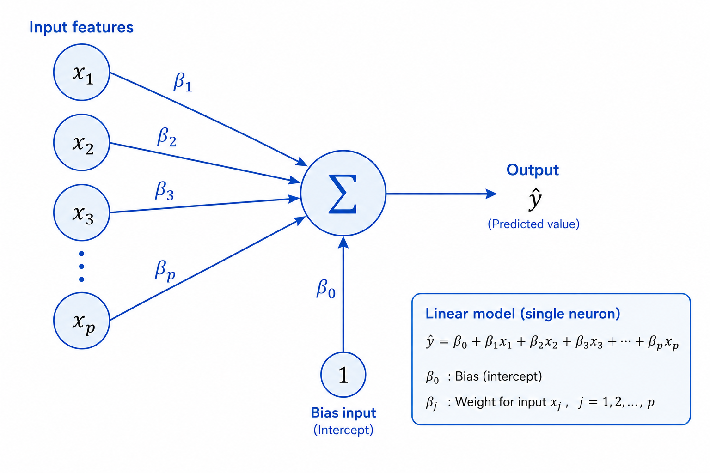

# Multiple Linear Regression
> More features, more power — predicting with the full picture

**What you will learn:** In this module you will understand how Multiple Linear Regression extends Simple Linear Regression to handle many input features simultaneously, how coefficients are found using matrix algebra, what multicollinearity is and why it is dangerous, and how Adjusted R² gives a fairer model evaluation than plain R².

---

## 1. What is Multiple Linear Regression?

Multiple Linear Regression (MLR) is the extension of Simple Linear Regression to **multiple input features**. Instead of one predictor, we use p predictors simultaneously to predict a continuous output.

Think of estimating a house price not just from its size, but from size, number of bedrooms, location quality, year built, and garage capacity — all at once. Each feature contributes its own piece of information, and MLR combines them into one prediction. The model learns how much each feature contributes **independently of the others** — this is called a partial effect.

The power of MLR over SLR is that real-world outcomes are rarely driven by just one factor. MLR lets the model learn these partial effects — the contribution of each feature holding all others constant — which is both more accurate and more informative than any single predictor alone.

---

## 2. Mathematical Formulation

The MLR equation with p features:

```
ŷ = β₀ + β₁x₁ + β₂x₂ + ... + βₚxₚ
```

In compact matrix form:

```
ŷ = Xβ
```

| Symbol | Meaning |
|--------|---------|
| **X** | Feature matrix of shape (n × p+1), with a leading column of 1s for the intercept |
| **β** | Coefficient vector of shape (p+1 × 1), one value per feature plus intercept |
| **ŷ** | Predicted output vector of shape (n × 1) |
| **βⱼ** | Partial slope — effect of xⱼ on y, holding all other features constant |
| **n** | Number of training samples |
| **p** | Number of input features |

The Normal Equation — closed-form OLS solution for all coefficients at once:

```
β = (XᵀX)⁻¹ Xᵀy
```

**What this tells us:** We find the entire coefficient vector β in one matrix operation. Each βⱼ tells us how much y changes for a 1-unit increase in xⱼ, assuming all other features stay fixed. This "holding others constant" interpretation is what makes MLR both powerful and nuanced — it separates each feature's individual contribution.

Adjusted R² penalizes adding unnecessary features:

```
Adjusted R² = 1 - (1 - R²) × (n - 1) / (n - p - 1)
```

**What this tells us:** Plain R² always increases when you add more features — even useless ones. Adjusted R² only increases if the new feature genuinely improves the model beyond what chance would give you.

---

## 3. How It Works — Step by Step

1. **Collect multiple features** — gather all relevant input variables (e.g., size, rooms, quality)
2. **Build the feature matrix X** — shape (n × p), then prepend a column of 1s for β₀
3. **Apply the Normal Equation** — β = (XᵀX)⁻¹Xᵀy gives all p+1 coefficients at once
4. **Interpret coefficients** — each βⱼ is a partial effect, independent of other features
5. **Check for multicollinearity** — highly correlated features make βⱼ unstable
6. **Evaluate with Adjusted R²** — fairer comparison than R² across different feature counts
7. **Predict** — ŷ = Xβ for any new data point (with bias column prepended)

> 🔍 *Analogy: MLR is like a panel of judges each scoring one aspect of a performance — stage presence, vocals, rhythm. The final score is a weighted sum of all judges, each contributing independently. MLR learns the optimal weights (β) for each judge (feature).*

> 🖼️ 
*Source: [Generated using ChatGPT (OpenAI)]*

---

## 4. Key Assumptions

| Assumption | What Happens if Violated |
|------------|--------------------------|
| **Linearity** — each xⱼ has a linear relationship with y | Systematic prediction errors across feature value ranges |
| **Independence** — observations do not influence each other | Standard errors are underestimated; coefficients unreliable |
| **Normality** — residuals are normally distributed around zero | Prediction intervals become inaccurate |
| **Equal variance** (Homoscedasticity) — residual spread is constant | Coefficient estimates inefficient; confidence intervals wrong |
| **No multicollinearity** — features are not highly correlated with each other | Coefficients become huge, unstable, and flip signs with small data changes |

---

## 5. When to Use / When Not to Use

| ✅ Use MLR When | ❌ Avoid When |
|----------------|---------------|
| Multiple features influence the target | You have only one predictor (use SLR instead) |
| Relationships are approximately linear | Strong non-linear patterns exist in data |
| Feature interpretability matters | You have thousands of features (use regularized regression) |
| You need the partial effect of each feature | Features are highly multicollinear (use Ridge) |
| Dataset is moderate sized (n >> p) | Very small dataset with many features — p close to n |

---

## 6. Implementation Overview

| Approach | Tool | Method |
|----------|------|--------|
| **From Scratch** | NumPy | Normal Equation: β = (XᵀX)⁻¹Xᵀy using `np.linalg.inv` |
| **Library** | Scikit-learn | `LinearRegression().fit(X, y)` — same math, LAPACK-optimized |

```python
from sklearn.linear_model import LinearRegression

model = LinearRegression()
model.fit(X_train, y_train)       # X_train shape: (n_samples, n_features)

print(model.coef_)                # β₁ to βₚ — one per feature
print(model.intercept_)           # β₀ — the intercept
```

The key difference from SLR: X is now a full matrix (n × p). The Normal Equation β = (XᵀX)⁻¹Xᵀy works identically — SLR is just the special case where p = 1.

---

## 7. Top 5 Interview Questions

1. **How does MLR differ from SLR mathematically?**
   - SLR: ŷ = β₀ + β₁x (scalar), β₁ = Cov(x,y)/Var(x)
   - MLR: ŷ = Xβ (matrix form), β = (XᵀX)⁻¹Xᵀy
   - Same OLS principle — minimize SSR — extended to p features simultaneously

2. **What is multicollinearity and how do you detect and fix it?**
   - When two or more input features are highly correlated with each other
   - Detection: correlation heatmap, Variance Inflation Factor (VIF > 10 = serious problem)
   - Fix: remove one of the correlated features, apply PCA, or use Ridge regression

3. **Why use Adjusted R² instead of plain R²?**
   - R² always increases when you add more features — even completely random ones
   - Adjusted R² penalizes for extra features — only increases if the new feature truly helps
   - Always use Adjusted R² when comparing models that have different numbers of features

4. **What happens to coefficients when features are highly correlated?**
   - (XᵀX) becomes near-singular — its determinant approaches zero
   - The inverse (XᵀX)⁻¹ blows up — coefficients become huge and unstable
   - Fix: Ridge adds αI to make (XᵀX + αI) invertible and numerically stable

5. **How do you select which features to include in MLR?**
   - Start with correlation analysis between each feature and the target
   - Use forward or backward stepwise selection based on Adjusted R²
   - Apply Lasso regression — L1 penalty automatically zeros out irrelevant features
   - Always apply domain knowledge first — the strongest filter of all

---

## 8. Quick Reference Table

| Item | Detail |
|------|--------|
| **Algorithm Type** | Supervised — Regression |
| **Input Features** | p features (p ≥ 2) |
| **Output Type** | Continuous numerical value |
| **Time Complexity** | O(np²) to build XᵀX + O(p³) for matrix inverse |
| **Space Complexity** | O(np) for the feature matrix |
| **Key Parameters** | β vector — p+1 coefficients (one per feature + intercept) |
| **Key Metrics** | MSE, RMSE, MAE, R², Adjusted R² |
| **Multicollinearity Check** | Correlation heatmap, VIF (statsmodels) |
| **Sensitive To** | Multicollinearity, outliers, irrelevant features |

---

## 9. References & Further Reading

1. [Scikit-learn LinearRegression Documentation](https://scikit-learn.org/stable/modules/linear_model.html)
2. [Kaggle: House Prices — Advanced Regression Techniques](https://www.kaggle.com/c/house-prices-advanced-regression-techniques)
3. [StatQuest: Multiple Regression Clearly Explained (YouTube)](https://www.youtube.com/watch?v=zITIFTsivN8)
4. [An Introduction to Statistical Learning — James et al. Chapter 3.2](https://www.statlearning.com/)
5. [Towards Data Science: Multicollinearity Explained](https://towardsdatascience.com/multicollinearity-in-regression-analysis-problems-detection-and-solutions-7e22f31f5e)
