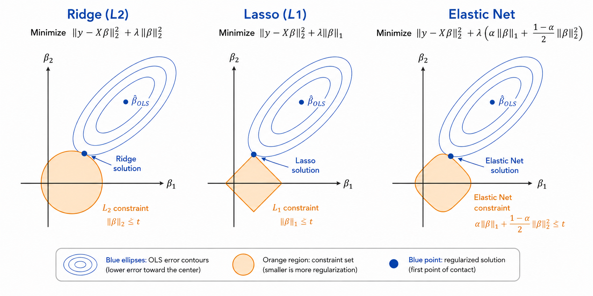

# Ridge, Lasso & Elastic Net Regression
> Taming overfitting — regularization for linear models

**What you will learn:** In this module you will understand why plain Linear Regression overfits when features are numerous or correlated, how Ridge (L2), Lasso (L1), and Elastic Net (L1+L2) penalties constrain the coefficient vector, how the regularization strength α controls the bias-variance tradeoff, and how to implement and tune all three from scratch and with scikit-learn on real-world data.

---

## 1. What is Regularized Regression?

Ridge, Lasso, and Elastic Net are extensions of Multiple Linear Regression that add a **penalty term** to the loss function to discourage large coefficients. Instead of minimizing only the Sum of Squared Residuals (SSR), these models minimize SSR **plus** a penalty based on the size of the coefficients.

Think of MLR as a student who memorizes every detail of the training data — including noise — to score perfectly on practice tests, but then performs poorly on the real exam. Regularization is like a teacher who tells the student: "Keep your answer simple — don't rely too heavily on any single fact." This forces the model to generalize better to unseen data.

The word "regularization" means making the model more "regular" — smoother, less extreme, less sensitive to any one feature or training point. Ridge shrinks coefficients smoothly toward zero; Lasso can shrink them all the way to exactly zero (automatic feature selection); Elastic Net blends both behaviors.

---

## 2. Mathematical Formulation

All three models still predict using the same linear equation:

```
ŷ = β₀ + β₁x₁ + β₂x₂ + ... + βₚxₚ = Xβ
```

But each minimizes a **different loss function**:

| Model | Loss Function | Penalty Type |
|-------|---------------|--------------|
| **Ridge** | SSR + α·Σβⱼ² | L2 — squared magnitude |
| **Lasso** | SSR + α·Σ\|βⱼ\| | L1 — absolute magnitude |
| **Elastic Net** | SSR + α·[r·Σ\|βⱼ\| + (1-r)·Σβⱼ²] | L1 + L2 mix |

| Symbol | Meaning |
|--------|---------|
| **α (alpha)** | Regularization strength — 0 means no penalty (plain OLS), larger α shrinks coefficients more |
| **r (l1_ratio)** | Elastic Net mixing parameter — r=1 is pure Lasso, r=0 is pure Ridge |
| **βⱼ** | Coefficient for feature j — the value being penalized |
| **Σβⱼ²** | L2 norm squared — sum of squared coefficients |
| **Σ\|βⱼ\|** | L1 norm — sum of absolute coefficients |

Ridge has a closed-form solution (Normal Equation with a ridge term added):

```
β = (XᵀX + αI)⁻¹ Xᵀy
```

**What this tells us:** Adding αI to XᵀX makes the matrix always invertible — even under perfect multicollinearity — and shrinks all coefficients toward zero proportionally. Lasso and Elastic Net have no closed-form solution because |βⱼ| is not differentiable at zero; they require iterative optimization (coordinate descent).

> **Important:** The intercept β₀ is **never** penalized — only β₁...βₚ are shrunk. Features must be **standardized** before regularization, otherwise features with larger scales get penalized unfairly more (or less) than small-scale features.

---

## 3. How It Works — Step by Step

1. **Standardize features** — subtract mean, divide by std (critical — penalty is scale-dependent)
2. **Choose a model** — Ridge (correlated features, keep all), Lasso (want feature selection), Elastic Net (correlated features + want selection)
3. **Choose α** — small α ≈ plain OLS, large α ≈ all coefficients shrink toward (or to) zero
4. **Fit the model** — Ridge has closed-form β = (XᵀX + αI)⁻¹Xᵀy; Lasso/Elastic Net use coordinate descent
5. **Inspect coefficients** — Ridge: all shrink, none exactly zero. Lasso: some become exactly zero (sparse model)
6. **Tune α with cross-validation** — plot validation error vs α, pick the α that minimizes it
7. **Evaluate** — compute RMSE, R², and compare against unregularized MLR as a baseline

> 🔍 *Analogy: Imagine each coefficient βⱼ is a rubber band pulling toward zero. OLS lets each band stretch freely to fit the data perfectly. Ridge adds a gentle, constant pull on every band — they all shrink a little, but none snap to zero. Lasso adds a pull strong enough that weak bands snap completely — those features are eliminated entirely.*

> 🖼️ 
*Source: [Generated using ChatGPT (OpenAI)]*
---

## 4. Key Assumptions

| Assumption | What Happens if Violated |
|------------|--------------------------|
| **Linearity** — relationship between X and y is linear | Regularization cannot fix a fundamentally wrong functional form |
| **Features are standardized** — same scale before penalizing | Penalty is applied unevenly; large-scale features are over-penalized |
| **Independence** — observations do not influence each other | Standard errors and CV estimates become unreliable |
| **α is properly tuned** — chosen via cross-validation, not guessed | Too small → model behaves like OLS (overfits); too large → underfits (all βⱼ → 0) |

---

## 5. When to Use / When Not to Use

| ✅ Use Regularization When | ❌ Avoid When |
|----------------------------|---------------|
| You have many features relative to samples (p close to n) | You have very few features and plenty of data (plain OLS is fine) |
| Features are highly correlated (multicollinearity) | Coefficients must remain perfectly unbiased for inference |
| You suspect overfitting (high train R², low test R²) | The model is already underfitting |
| You want automatic feature selection → use **Lasso** | You need all features retained with mild shrinkage → use **Ridge** |
| You have correlated groups of features → use **Elastic Net** | α has not been tuned via cross-validation |

---

## 6. Implementation Overview

| Approach | Tool | Method |
|----------|------|--------|
| **From Scratch (Ridge)** | NumPy | Closed-form: β = (XᵀX + αI)⁻¹Xᵀy |
| **From Scratch (Lasso/Elastic Net)** | NumPy | Coordinate Descent with soft-thresholding |
| **Library** | Scikit-learn | `Ridge()`, `Lasso()`, `ElasticNet()` — all share `.fit(X, y)` API |

```python
from sklearn.linear_model import Ridge, Lasso, ElasticNet

ridge = Ridge(alpha=1.0)
lasso = Lasso(alpha=1.0)
elastic = ElasticNet(alpha=1.0, l1_ratio=0.5)

for model in [ridge, lasso, elastic]:
    model.fit(X_train_scaled, y_train)
    print(model.coef_)        # Coefficients — Lasso may show exact zeros
    print(model.intercept_)   # β₀ — never penalized
```

The `alpha` parameter controls regularization strength for all three. `l1_ratio` (Elastic Net only) controls the L1/L2 mix — `l1_ratio=1.0` is equivalent to Lasso, `l1_ratio=0.0` is equivalent to Ridge.

---

## 7. Top 5 Interview Questions

1. **What is the difference between Ridge, Lasso, and Elastic Net?**
   - Ridge (L2): shrinks all coefficients smoothly, never to exactly zero — keeps all features
   - Lasso (L1): can shrink coefficients to exactly zero — performs automatic feature selection
   - Elastic Net: combines both penalties — useful when features are correlated *and* selection is wanted

2. **Why does Lasso produce sparse solutions but Ridge does not?**
   - Geometrically, the L1 constraint region is a diamond with sharp corners on the axes; the L2 constraint region is a smooth circle/ellipsoid
   - The OLS error contours are far more likely to first touch the L1 diamond at a corner (where one or more βⱼ = 0) than the smooth L2 circle
   - Algebraically, the L1 penalty's subgradient allows a coefficient to be pushed to exactly zero and stay there; the L2 penalty's gradient shrinks proportionally but never reaches zero

3. **Why must features be standardized before regularization?**
   - The penalty term Σβⱼ² (or Σ|βⱼ|) treats all coefficients equally regardless of their feature's scale
   - A feature measured in millions (e.g., square footage) would naturally have a tiny βⱼ, while a feature measured in single digits (e.g., number of rooms) would have a large βⱼ
   - Without standardization, the penalty would unfairly shrink large-scale-feature coefficients more (or less) based on units, not importance

4. **How do you choose the optimal value of α?**
   - Use k-fold cross-validation: train on k-1 folds, validate on the remaining fold, for a range of α values (often log-spaced, e.g., 0.001 to 100)
   - Plot validation error (or R²) vs α — pick the α at the minimum validation error
   - `RidgeCV`, `LassoCV`, and `ElasticNetCV` automate this search

5. **What happens as α → 0 and as α → ∞?**
   - As α → 0: penalty term vanishes, model converges to plain OLS (high variance, low bias)
   - As α → ∞: penalty dominates, all βⱼ → 0 (for Ridge) or exactly 0 (for Lasso), model converges to predicting the mean ȳ (high bias, low variance)
   - The optimal α sits between these extremes, balancing bias and variance

---

## 8. Quick Reference Table

| Item | Detail |
|------|--------|
| **Algorithm Type** | Supervised — Regression (Regularized) |
| **Input Features** | p features (p ≥ 1), standardization required |
| **Output Type** | Continuous numerical value |
| **Key Hyperparameter** | α (alpha) — regularization strength |
| **Extra Hyperparameter (Elastic Net)** | l1_ratio (r) — L1/L2 mix, 0 ≤ r ≤ 1 |
| **Closed-Form Solution** | Ridge only: β = (XᵀX + αI)⁻¹Xᵀy |
| **Optimization (Lasso/Elastic Net)** | Coordinate Descent (no closed form) |
| **Key Metrics** | MSE, RMSE, MAE, R², Adjusted R² |
| **Feature Selection** | Lasso and Elastic Net (Ridge never zeroes coefficients) |
| **Sensitive To** | Feature scale (must standardize), choice of α |

---

## 9. References & Further Reading

1. [Scikit-learn Ridge, Lasso, ElasticNet Documentation](https://scikit-learn.org/stable/modules/linear_model.html)
2. [Kaggle: House Prices — Advanced Regression Techniques](https://www.kaggle.com/c/house-prices-advanced-regression-techniques)
3. [StatQuest: Ridge, Lasso, and Elastic Net Clearly Explained (YouTube)](https://www.youtube.com/watch?v=Q81RR3yKn30)
4. [An Introduction to Statistical Learning — James et al. Chapter 6](https://www.statlearning.com/)
5. [Towards Data Science: Ridge vs Lasso Regression Explained](https://towardsdatascience.com/ridge-and-lasso-regression-a-complete-guide-with-python-scikit-learn-e20e34bcbf0b)
